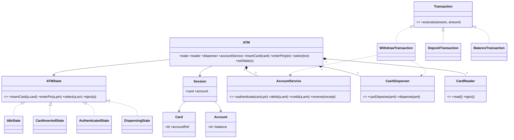

# ATM

An ATM is a state machine plus a money-movement protocol. The pressure is not the menu; it is that **money must move atomically** — never dispense cash without a successful debit, never debit without dispensing — while the hardware (card reader, dispenser) is flaky and must stay isolated behind interfaces.

This follows the [8-phase LLD path](index.md): requirements → entities → responsibilities → relationships/interfaces → class diagram → core flows → critical code → edge cases/extensibility.

## 1. Requirements / Use Cases

Clarify, then scope explicitly.

Questions worth asking:

- Card + PIN only, or also contactless?
- Which transactions — withdraw, deposit, balance, transfer?
- Do we model the bank backend, or assume an `AccountService`?
- What happens if the dispenser jams after the account was debited?
- Daily limits, retries on a wrong PIN?

In scope for this design:

1. **Insert card → enter PIN → authenticate** against the bank.
2. **Withdraw**, **deposit**, and **check balance**.
3. **Dispense cash** in denominations, and take deposits.
4. **Eject the card** and end the session.
5. Keep the ATM and the bank in agreement.

Non-functional assumptions:

- **Invariant 1:** cash is never dispensed unless the account debit succeeded.
- **Invariant 2:** the account is never debited unless cash (or a deposit credit) is actually applied.
- **Invariant 3:** a session handles one customer at a time.
- Scale: one machine, a handful of denominations, a few transactions per minute.

Out of scope: inter-bank card networks, transfers between accounts, cheque deposit, and biometrics.

## 2. Core Entities

Objects with identity:

- `ATM` — the facade the screen, keypad, and hardware talk to.
- `Card` — the inserted card (a reference to an account).
- `Account` — balance and ownership.
- `AccountService` (the bank) — `authenticate`, `debit`, `credit`.
- `CashDispenser` — the note inventory and dispensing (can fail).
- `CardReader` — reads and returns the card.
- `Session` — the current customer's context (card, authenticated account).
- `Transaction` — one operation (withdraw/deposit/balance).
- `Receipt` — the printed result.

Value objects and enums:

- `Money`, `Denomination` (`100 | 50 | 20`), and the ATM states `IDLE | CARD_INSERTED | AUTHENTICATED | DISPENSING | DONE`.

Abstractions (from the requirements):

- `Transaction` — the operation varies (Strategy).
- `CashDispenser` — hardware seam, so it can be faked and can fail.
- `AccountService` — the bank boundary.

## 3. Responsibilities

Assign each behavior to the class that owns the state it needs.

| Class | Owns / is responsible for |
|---|---|
| `ATM` | The current `State` and delegating actions to it; it does not contain per-state rules. |
| `ATMState` (`Idle`, `CardInserted`, `Authenticated`, `Dispensing`) | What each action does in that state and which transitions are legal. |
| `Session` | The current card and authenticated account. |
| `Transaction` | Executing one operation against the bank and the dispenser. |
| `AccountService` | Authentication and the balance mutation (debit/credit). |
| `CashDispenser` | The note inventory and the physical dispense. |
| `CardReader` | Reading and ejecting the card. |

Deliberately *not* placed:

- All the `if (state === ...)` logic inside `ATM` — that is a state machine in disguise.
- Dispensing inside `Transaction` — a transaction decides *how much*; the dispenser decides *which notes*.
- Balance mutation inside the ATM. The bank owns the account; the ATM only asks.

## 4. Relationships + Interfaces

is-a / has-a / uses-a, then interfaces at the points likely to change.

Relationships:

- `ATM` **has** a `CardReader`, a `CashDispenser`, a `Screen`, a `Keypad`, and one current `State`.
- `Session` **references** a `Card` and an authenticated `Account`.
- `Transaction` **uses** `AccountService` and (for withdrawals) `CashDispenser`.

Interfaces — discovered from requirements that will change:

- "Which operation?" varies (withdraw, deposit, balance) → **`Transaction`**.
- "How does the machine read/eject cards?" is hardware → **`CardReader`**.
- "How does cash come out?" is hardware that can fail → **`CashDispenser`**.
- "How does the bank authenticate and move money?" is external → **`AccountService`**.

```txt
interface Transaction
  execute(session: Session, amount: Money) -> TransactionResult

interface AccountService
  authenticate(card: Card, pin: string) -> Account
  debit(account: Account, amount: Money) -> Receipt
  credit(account: Account, amount: Money) -> Receipt
  reverse(receipt: Receipt)                     // compensating action

interface CashDispenser
  canDispense(amount: Money) -> boolean
  dispense(amount: Money) -> Money[]            // returns the notes; may throw Jam
```

The **State pattern** falls out of "behavior depends on the session state"; the **Strategy pattern** falls out of "the operation varies". The compensating `reverse` is what makes the money protocol atomic in practice.

## 5. Class Diagram



Important methods (not every getter):

- `ATM`: `insertCard(card)`, `enterPin(pin)`, `select(txn)`, `setState(s)`.
- `ATMState`: `insertCard/enterPin/select/eject`.
- `Transaction`: `execute(session, amount)`.
- `AccountService`: `authenticate`, `debit`, `credit`, `reverse`.
- `CashDispenser`: `canDispense`, `dispense`.

## 6. Core Flows

Execute the use cases through the objects.

Authenticate:

```text
IdleState.insertCard(card)
    ↓
CardReader.read() → card; Session created
    ↓
→ CARD_INSERTED
    ↓
CardInsertedState.enterPin("1234")
    ↓
AccountService.authenticate(card, pin) → Account
    ↓
→ AUTHENTICATED
```

Withdraw (the money-atomic path):

```text
AuthenticatedState.select(Withdraw($100))
    ↓
WithdrawTransaction.execute(session, $100)
    ↓
AccountService.debit(account, $100)          // money leaves the account first
    ↓
CashDispenser.canDispense($100)?
    ↓ yes
CashDispenser.dispense($100) → [$100 note]   // may throw Jam
    ↓ success
Receipt printed → DONE
    ↓ jam
AccountService.reverse(debitReceipt)         // compensating action; account restored
    ↓
Report "cannot dispense"; DONE
```

State transition table:

| State | Action | Next | Guard |
|---|---|---|---|
| `IDLE` | insertCard | `CARD_INSERTED` | card readable |
| `CARD_INSERTED` | enterPin | `AUTHENTICATED` | PIN valid (retry limit) |
| `AUTHENTICATED` | select(Withdraw) | `DISPENSING` | balance and cash sufficient |
| `AUTHENTICATED` | select(Balance) | `AUTHENTICATED` | — |
| `DISPENSING` | (dispensed) | `DONE` | dispenser succeeded |
| `DISPENSING` | (jam) | `DONE` | debit reversed |
| any | eject | `IDLE` | — |

## 7. Implement Critical Code

Implement the state boundary and the withdraw protocol; skip UI and boilerplate.

```txt
class WithdrawTransaction implements Transaction
  execute(session, amount):
    account = session.account
    if account.balance < amount: return InsufficientFunds
    if not dispenser.canDispense(amount): return CannotDispense

    receipt = accountService.debit(account, amount)      // 1. debit first
    try:
      notes = dispenser.dispense(amount)                 // 2. dispense second
      return Success(notes, receipt)
    catch Jam:
      accountService.reverse(receipt)                    // 3. compensate on failure
      return DispenseFailed(reversed = true)

class DepositTransaction implements Transaction
  execute(session, amount):
    accountService.credit(session.account, amount)       // deposit is credit-only
    return Success(amount)

class AuthenticatedState implements ATMState
  select(atm, txn):
    result = txn.execute(atm.session, txn.amount)
    atm.setState(new DoneState())
    return result

class CardInsertedState implements ATMState
  enterPin(atm, pin):
    account = atm.accountService.authenticate(atm.session.card, pin)
    if account == null: atm.retries += 1; return InvalidPin   // eject after N
    atm.session.account = account
    atm.setState(new AuthenticatedState())
```

## 8. Edge Cases + Extensibility + Wrap-Up

Attack your own design:

- **Dispenser jam after debit.** Reverse the debit (`accountService.reverse`); never leave the customer debited without cash.
- **Insufficient ATM cash.** Check `canDispense` *before* debiting so the customer is never charged for notes the machine cannot produce.
- **Backend timeout during debit.** The debit is idempotent by transaction id; retry the status query rather than debiting twice.
- **Wrong PIN.** Count retries and eject the card after the limit; never leak whether the card or the PIN was wrong.
- **Partial dispense.** Dispense the full set or none; a partial dispense must not partially debit.
- **Power loss mid-dispense.** On boot, reconcile: any debit without a matching dispense receipt is reversed.
- **Deposit without envelope verification.** Credit is provisional until the amount is verified; keep the two-phase boundary.

Then say how change is absorbed — the part the interviewer is listening for:

- **New transaction type** (transfer, top-up) → add a `Transaction` implementation.
- **New hardware** (contactless reader, note recycler) → a new adapter behind `CardReader` / `CashDispenser`.
- **New dispense policy** (largest notes first, minimise notes) → a `DispenseStrategy`, not an edit to `Transaction`.
- **New bank protocol** → a new `AccountService` implementation.

Concurrency, stated plainly: the shared state is the **cash inventory** and the **session**. One ATM serves one customer, so the session is single-threaded; the cash inventory must be decremented atomically with the dispense, and the debit/dispense pair must be reconciled by a compensating action. The invariant under any interleaving: **account movement and cash movement agree, or neither happens**.

Trade-offs:

| Choice | Why | Alternative | Trade-off |
|---|---|---|---|
| State pattern for the ATM | Illegal transitions become unreachable | `if (state === ...)` in `ATM` | Fewer classes, but every rule is reachable |
| Debit-then-dispense + reverse | Customer is never charged for nothing | Dispense-then-debit | Risks giving cash for free |
| `Transaction` as a Strategy | New operations without touching the ATM | A switch in `AuthenticatedState` | Simpler, but every new op edits the state |
| Hardware behind interfaces | Testable with fakes; hardware fails | Direct motor calls | Real, but untestable and brittle |

## Interactive Visualizer

Use the ATM like a customer: **Insert card** (pick the account), enter the **PIN** on the keypad, choose **Withdraw / Deposit / Balance**, pick an amount, and confirm. Watch the **state machine** move `IDLE → CARD_INSERTED → AUTHENTICATED → DISPENSING → DONE`, with cash appearing in the tray. A dispense **jam** triggers the compensating reverse. Press **▶ Play** to run customers. Use the **design lens** to swap the **dispense order** and the **failure policy** (rollback ↔ retry), and step through the **1–8** phase map.

<div
  id="atm-visualizer"
  class="atv atm-visualizer"
></div>

## Interview recap

The answer is: "the ATM is a state machine; each state owns its legal transitions; a `Transaction` strategy performs the operation against an `AccountService`; and the withdraw path debits, dispenses, and reverses on failure so money never moves on one side only."

Likely follow-ups:

- Where exactly do you guarantee the customer is never debited without cash?
- The dispenser jams after the debit — what is the compensating action?
- How do you add a transfer transaction without touching the ATM states?
- Why check `canDispense` before debiting rather than after?
