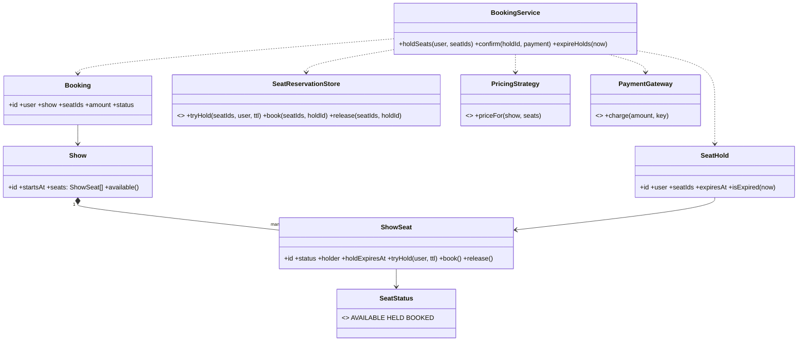

# BookMyShow

A ticket-booking system is a concurrency problem wearing a catalog. The hard part is not listing movies; it is that **many users race for the same seat**, holds must expire, and a payment boundary must never oversell or double-charge. Every design decision follows from "a seat is booked at most once per show".

This follows the [8-phase LLD path](index.md): requirements → entities → responsibilities → relationships/interfaces → class diagram → core flows → critical code → edge cases/extensibility.

## 1. Requirements / Use Cases

Clarify, then scope explicitly.

Questions worth asking:

- Movies → theatres → screens → shows; how deep is the catalog?
- Do users pick seats on a seat map, or are seats auto-assigned?
- Are seats held during payment? For how long?
- What happens when a hold expires mid-payment?
- Refunds, cancellations, waitlists?

In scope for this design:

1. A **show** has a **seat map** of show-seats.
2. A user **holds** one or more seats for a short TTL.
3. The user **pays**; on success the seats become **booked** and a **booking** is created.
4. Holds **expire** automatically and release the seats.
5. Two users **cannot** book the same seat.

Non-functional assumptions:

- **Invariant 1:** a seat is `BOOKED` at most once per show (no oversell).
- **Invariant 2:** a hold is exclusive — only the holder can confirm it.
- **Invariant 3:** confirming a booking is idempotent; a retried payment does not create two bookings.

Out of scope: recommendations, loyalty pricing, refund workflows, and seat-map rendering performance.

## 2. Core Entities

Objects with identity:

- `Movie`, `Theatre`, `Screen` — the catalog.
- `Show` — a screening at a screen/time; owns its `ShowSeat`s.
- `ShowSeat` — one seat's state for one show (the unit of contention).
- `SeatHold` — a short-lived lease on one or more show-seats.
- `Booking` — a confirmed purchase.
- `User` — the customer.
- `Payment` — a payment attempt.

Value objects and enums:

- `Money`, `SeatStatus` = `AVAILABLE | HELD | BOOKED`.

Abstractions (from the requirements):

- `PricingStrategy` — how a seat is priced.
- `PaymentGateway` — the payment boundary.
- `SeatReservationStore` — the atomic hold/book operation.

## 3. Responsibilities

Assign each behavior to the class that owns the state it needs.

| Class | Owns / is responsible for |
|---|---|
| `Show` | Its seat map and which seats are free. |
| `ShowSeat` | Its own status and the **atomic** `tryHold` / `book` / `release`. This is where the oversell invariant lives. |
| `SeatHold` | The lease: which seats, which user, and when it expires. |
| `BookingService` | The workflow: hold → pay → confirm. It coordinates; it does not own seat state. |
| `PricingStrategy` | Computing the price for a set of seats. |
| `PaymentGateway` | Charging and returning a result. |
| `Booking` | The immutable confirmation record. |

Deliberately *not* placed:

- Hold/booking logic inside `Show`. A show is a container; contention is per seat.
- Payment inside `SeatHold`. A hold is a lease, not a transaction.
- Expiry scattered across services. Holds carry their own deadline and are swept.

## 4. Relationships + Interfaces

is-a / has-a / uses-a, then interfaces at the points likely to change.

Relationships:

- `Show` **has many** `ShowSeat` (composition).
- `Booking` **references** a `Show`, a `User`, and the booked `ShowSeat`s.
- `SeatHold` **references** a `User` and one or more `ShowSeat`s, with an `expiresAt`.
- `BookingService` **uses** `SeatReservationStore`, `PricingStrategy`, and `PaymentGateway`.

Interfaces — discovered from requirements that will change:

- "How is a seat priced?" varies (flat, premium, surge) → **`PricingStrategy`**.
- "How is it paid?" varies (card, wallet, UPI) → **`PaymentGateway`**.
- "How is a hold made atomic?" is infrastructure → **`SeatReservationStore`**.

```txt
interface SeatReservationStore
  tryHold(seatIds: SeatId[], user: UserId, ttl) -> HoldResult   // atomic; fails if any seat is taken
  book(seatIds: SeatId[], holdId) -> BookingResult
  release(seatIds: SeatId[], holdId)

interface PricingStrategy
  priceFor(show: Show, seats: ShowSeat[]) -> Money

interface PaymentGateway
  charge(amount: Money, idempotencyKey: string) -> PaymentResult
```

The **State pattern** falls out of "a seat's behavior depends on its status"; the **Strategy pattern** falls out of pricing and payment varying independently.

## 5. Class Diagram



Important methods (not every getter):

- `ShowSeat`: `tryHold(user, ttl)`, `book()`, `release()`.
- `BookingService`: `holdSeats(user, seatIds)`, `confirm(holdId, payment)`, `expireHolds(now)`.
- `SeatReservationStore`: `tryHold`, `book`, `release`.
- `PricingStrategy`: `priceFor(show, seats)`.

## 6. Core Flows

Execute the use cases through the objects.

Hold:

```text
User selects seats A1, A2 → BookingService.holdSeats(user, [A1,A2])
    ↓
SeatReservationStore.tryHold([A1,A2], user, ttl)     // atomic
    ↓
for each seat: if status != AVAILABLE → fail the whole hold (release the ones already held)
    ↓
SeatHold created (user, seatIds, expiresAt = now + ttl)
    ↓
Seats now HELD; other users see them as taken
```

Pay and confirm:

```text
BookingService.confirm(holdId, payment)
    ↓
if hold expired → fail (seats may be gone)
    ↓
amount = PricingStrategy.priceFor(show, seats)
    ↓
PaymentGateway.charge(amount, idempotencyKey = holdId)     // idempotent
    ↓
if payment ok → SeatReservationStore.book(seatIds, holdId)  // atomic; unique per seat
    ↓
Booking created; seats BOOKED; hold cleared
```

Expiry sweep:

```text
BookingService.expireHolds(now)
    ↓
for each hold where expiresAt <= now: release its seats → AVAILABLE
```

The race — two users, one seat:

```text
User A: tryHold([A1]) → status AVAILABLE → HELD(A)
User B: tryHold([A1]) → status HELD → fail("seat taken")
```

The atomic check-and-set in `tryHold` is the whole oversell guarantee.

## 7. Implement Critical Code

Implement the atomic hold, the idempotent confirm, and the expiry sweep; skip CRUD.

```txt
class ShowSeat
  status: SeatStatus = AVAILABLE
  holder: UserId = null
  holdExpiresAt: Time = null

  tryHold(user, ttl, now):            // compare-and-set; the critical section
    if status != AVAILABLE: return false
    status = HELD; holder = user; holdExpiresAt = now + ttl
    return true

  book():  status = BOOKED; holder = null; holdExpiresAt = null
  release(): if status == HELD: status = AVAILABLE; holder = null; holdExpiresAt = null

class BookingService
  holdSeats(user, seatIds):
    now = clock()
    held = []
    for id in seatIds:
      if seats[id].tryHold(user, HOLD_TTL, now): held.push(id)
      else: releaseAll(held); return HoldFailed(id)     // all-or-nothing
    return SeatHold(user, held, now + HOLD_TTL)

  confirm(holdId, payment):
    hold = holds[holdId]
    if hold == null or hold.isExpired(clock()): return HoldExpired
    amount = pricing.priceFor(hold.show, hold.seats)
    result = payment.charge(amount, idempotencyKey = holdId)   // retry-safe
    if not result.ok: releaseAll(hold.seatIds); return PaymentFailed
    store.book(hold.seatIds, holdId)                   // unique constraint per seat
    return Booking(user = hold.user, seats = hold.seatIds, amount = amount)

  expireHolds(now):
    for hold in holds where hold.expiresAt <= now: releaseAll(hold.seatIds); holds.remove(hold)
```

## 8. Edge Cases + Extensibility + Wrap-Up

Attack your own design:

- **Two users, one seat.** `tryHold` is a compare-and-set; only one wins. At the database, a unique constraint on `(show_id, seat_id)` for an active booking is the backstop.
- **Payment succeeded, confirm failed.** The booking is idempotent by `holdId`; retry confirm and reconcile from the payment record. Never charge twice.
- **Hold expires while paying.** Confirm checks expiry first; if it expired, release and refund (or fail before charging).
- **Partial hold.** Holds are all-or-nothing — a user holding A1 and A2 must not end up with only A1.
- **Double-tap confirm.** Second confirm for the same `holdId` returns the existing booking.
- **Expiry sweep lag.** A stale hold that has not been swept is still rejected at confirm because `isExpired` is checked, not just the sweeper.

Then say how change is absorbed — the part the interviewer is listening for:

- **New pricing** (premium rows, matinee, surge) → add a `PricingStrategy`.
- **New payment provider** → add a `PaymentGateway`.
- **Waitlists / auto-assign** → a new `SeatAllocator`; the seat state machine is unchanged.
- **Refunds / cancellations** → a `BOOKED → AVAILABLE` transition guarded by a refund record.

Concurrency, stated plainly: the shared mutable state is the **status of each show-seat**. Two operations must be atomic — the hold check-and-set and the booking write. Use a per-seat lock or an atomic compare-and-set in the store; a unique database constraint on active bookings is the final backstop. The invariant under any interleaving: **a seat has at most one active booking per show**.

Trade-offs:

| Choice | Why | Alternative | Trade-off |
|---|---|---|---|
| Hold with TTL | Frees abandoned carts without support | No holds (pay immediately) | Simpler, but worse UX and more failed payments |
| Atomic `tryHold` | Prevents oversell at the source | Check then write | Simpler code, but a race window |
| Unique constraint as backstop | Correctness even if the app has a bug | Trust the application only | One more failure path, but no double bookings |
| Idempotent confirm by `holdId` | Safe retries | New key per attempt | Simple, but a retry can double-charge |

## Interactive Visualizer

Book a show: pick the acting **user**, click seats, then **Hold** and **Pay & book**. Holds expire on the clock, so an unpaid hold releases by itself. Press **Race demo** to send both users at the same seat and watch the atomic hold reject one. Use the **design lens** to swap the **PricingStrategy** and **PaymentGateway**, inspect responsibilities, and step through the **1–8** phase map.

<div
  id="bookmyshow-visualizer"
  class="bmv bookmyshow-visualizer"
></div>

## Interview recap

The answer is: "a `Show` owns `ShowSeat`s; a seat owns its status and an atomic `tryHold`/`book`/`release`; a `SeatHold` is a TTL lease; `BookingService` coordinates hold → pay → confirm; and pricing and payment are replaceable policies."

Likely follow-ups:

- Where exactly do you prevent overselling, and what is the database backstop?
- Payment succeeded but the booking write failed — what now?
- Why hold seats at all instead of charging immediately?
- How would a waitlist or auto-assignment fit without touching the seat state machine?
