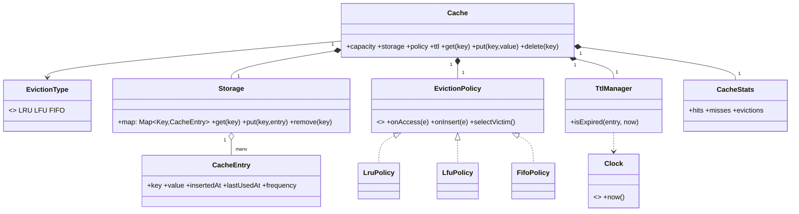

# Cache

A cache is a **fixed-capacity map with a victim-selection policy**. The pressure is that `get` and `put` must be O(1), the size must never exceed capacity, something must decide who gets evicted, and entries may expire. It is the classic **Strategy** problem with a data-structure twist: LRU needs a hash map plus a linked list.

This follows the [8-phase LLD path](index.md): requirements → entities → responsibilities → relationships/interfaces → class diagram → core flows → critical code → edge cases/extensibility.

## 1. Requirements / Use Cases

Clarify, then scope explicitly.

Questions worth asking:

- Which operations — `get`, `put`, `delete`?
- Fixed capacity, or a memory budget?
- Which eviction policy — LRU, LFU, FIFO, or random?
- Do entries expire (TTL)?
- Do we need hit/miss statistics? Is it thread-safe?

In scope for this design:

1. `get(key)`, `put(key, value)`, `delete(key)`.
2. A **fixed capacity**; evict when full.
3. **Pluggable eviction** — LRU, LFU, FIFO.
4. Optional **TTL** expiry.
5. **Stats**: hits, misses, evictions.

Non-functional assumptions:

- **Invariant 1:** `size <= capacity` at all times.
- **Invariant 2:** `get`/`put` are O(1) on average.
- **Invariant 3:** a `get` updates recency (LRU) or frequency (LFU) before any future eviction.

Out of scope: distributed caching, consistent hashing, and cache stampede protection (separate designs).

## 2. Core Entities

Objects with identity:

- `Cache` — the map plus capacity and orchestration.
- `CacheEntry` — key, value, and metadata (insertedAt, lastUsedAt, frequency).
- `EvictionPolicy` — selects the victim.
- `Storage` — the underlying hash map.
- `TtlManager` — expiry.
- `CacheStats` — counters.

Value objects and enums:

- `Key`, `Value`, `Duration`, `EvictionType` (`LRU | LFU | FIFO`).

Abstractions (from the requirements):

- `EvictionPolicy` — the policy varies.
- `Clock` — so TTL is testable without real time.

## 3. Responsibilities

Assign each behavior to the class that owns the state it needs.

| Class | Owns / is responsible for |
|---|---|
| `Cache` | Capacity, the map, and the get/put/evict orchestration. |
| `EvictionPolicy` | Choosing a victim from the current entries. Holds its own ordering structures. |
| `CacheEntry` | The value plus the metadata a policy needs. |
| `Storage` | O(1) key → entry lookup. |
| `TtlManager` | Whether an entry is expired. |
| `CacheStats` | Hit/miss/eviction counters. |

Deliberately *not* placed:

- Eviction logic inside `Cache` (`if policy == LRU ...`). Each policy owns its ordering structure.
- TTL checks scattered across `get`/`put`. Expiry is one manager.
- Stats as ad-hoc counters on the cache. One `CacheStats`.

## 4. Relationships + Interfaces

is-a / has-a / uses-a, then interfaces at the points likely to change.

Relationships:

- `Cache` **has** a `Storage`, an `EvictionPolicy`, a `TtlManager`, and a `CacheStats`.
- `Storage` **maps** keys to `CacheEntry`.
- `CacheEntry` **is tracked by** the `EvictionPolicy` (recency/frequency/insertion order).

Interfaces — discovered from requirements that will change:

- "Who gets evicted?" varies (LRU, LFU, FIFO) → **`EvictionPolicy`**.
- "When does it expire?" varies (TTL on/off) → **`TtlManager`**.
- "How do we read the clock?" varies (real, fake) → **`Clock`**.

```txt
interface EvictionPolicy
  onAccess(entry)          // update recency/frequency
  onInsert(entry)
  onRemove(entry)
  selectVictim() -> Key

interface TtlManager
  isExpired(entry, now) -> boolean
  onInsert(entry, now)
```

The **Strategy pattern** falls out of the eviction policy varying; **Decorator** falls out of adding TTL without changing the cache.

## 5. Class Diagram



Important methods (not every getter):

- `Cache`: `get(key)`, `put(key, value)`, `delete(key)`.
- `EvictionPolicy`: `onAccess(e)`, `onInsert(e)`, `selectVictim()`.
- `Storage`: `get`, `put`, `remove`.
- `TtlManager`: `isExpired(entry, now)`.

## 6. Core Flows

Execute the use cases through the objects.

get:

```text
Cache.get(key)
    ↓
entry = storage.get(key)
    ↓ miss
stats.misses += 1; return null
    ↓ hit
if ttl.isExpired(entry, clock.now()): remove; stats.misses += 1; return null
    ↓
policy.onAccess(entry)          // LRU: move to front; LFU: freq += 1
stats.hits += 1
return entry.value
```

put:

```text
Cache.put(key, value)
    ↓
existing = storage.get(key)
    ↓ exists
entry.value = value; policy.onAccess(entry); return
    ↓ new
if storage.size == capacity:
    victim = policy.selectVictim()      // LRU/LFU/FIFO decides
    storage.remove(victim); policy.onRemove(victim); stats.evictions += 1
    ↓
entry = CacheEntry(key, value, now)
storage.put(key, entry); policy.onInsert(entry)
```

Policy behaviour on the same access pattern:

| Access pattern | LRU victim | LFU victim | FIFO victim |
|---|---|---|---|
| get A, get B, put C (cap 2) | A (least recent) | A (freq 1, tie) | A (oldest) |
| get A, get A, get B, put C | B | B (freq 1) | A (oldest) |

## 7. Implement Critical Code

Implement the O(1) LRU (map + doubly linked list), the policy boundary, and get/put; skip metrics plumbing.

```txt
class LruPolicy implements EvictionPolicy
  order: DoublyLinkedList            // front = most recent, back = least recent
  nodes: Map<Key, Node>

  onAccess(entry): moveToFront(nodes[entry.key])
  onInsert(entry): node = order.pushFront(entry.key); nodes[entry.key] = node
  onRemove(entry): order.remove(nodes[entry.key]); nodes.delete(entry.key)
  selectVictim(): return order.back().key      // O(1)

class LfuPolicy implements EvictionPolicy
  freq: Map<Key, int>
  onAccess(entry): freq[key] += 1
  onInsert(entry): freq[key] = 1
  selectVictim(): return argmin(freq)          // O(n) unless a freq-indexed structure is kept

class Cache
  get(key):
    e = storage.get(key)
    if e == null: stats.misses++; return null
    if ttl.isExpired(e, clock.now()): storage.remove(key); policy.onRemove(e); stats.misses++; return null
    policy.onAccess(e); stats.hits++; return e.value

  put(key, value):
    e = storage.get(key)
    if e != null: e.value = value; policy.onAccess(e); return
    if storage.size() == capacity:
      victim = policy.selectVictim(); storage.remove(victim); policy.onRemove(storage.get(victim)); stats.evictions++
    e = CacheEntry(key, value, clock.now()); storage.put(key, e); policy.onInsert(e)
```

Note the LRU subtlety: a plain map plus "lastUsedAt" is O(n) to find the victim. The interview answer is the **hash map + doubly linked list**, which makes `onAccess` and `selectVictim` both O(1).

## 8. Edge Cases + Extensibility + Wrap-Up

Attack your own design:

- **Capacity 1.** Inserting a second key evicts the first; make sure the policy handles a single element.
- **Update vs insert.** `put` on an existing key updates the value and counts as an access (LRU) without changing size.
- **TTL vs eviction.** An expired entry should be removed lazily on access (and swept), not counted as a policy eviction.
- **Tie-breaking.** LFU with equal frequencies needs a rule (oldest wins) so behaviour is deterministic.
- **Concurrency.** Concurrent get/put must not corrupt the list; use a lock or lock striping, and keep the map and list update atomic.
- **Cache stampede.** A popular key expiring causes a thundering herd; coalesce misses (single-flight) — a separate concern but worth naming.

Then say how change is absorbed — the part the interviewer is listening for:

- **New policy** (random, MRU, ARC) → add an `EvictionPolicy`.
- **TTL on/off, per-entry TTL** → a `TtlManager` variant.
- **Metrics/observability** → `CacheStats` grows; the cache is unchanged.
- **Distributed cache** → the same interface over a remote store; the policy becomes approximate.

Concurrency, stated plainly: the shared mutable state is the **map plus the policy's ordering structure**. They must be updated together under one lock (or a striped lock per key range). The invariant under any interleaving: **size ≤ capacity and every key in the list is in the map**.

Trade-offs:

| Choice | Why | Alternative | Trade-off |
|---|---|---|---|
| Eviction as Strategy | Swap LRU/LFU/FIFO without touching `Cache` | `if policy == LRU` | Simpler, but every policy edits the cache |
| Map + doubly linked list | O(1) access and victim selection | Scan for least-recently-used | Simple, but O(n) per eviction |
| Lazy TTL + sweep | No timer per entry | Background timer per key | Precise, but heavy |
| Single lock | Simple and correct | Lock striping | Higher throughput, more complexity |

## Interactive Visualizer

Fill a small cache and watch it evict. **Put** and **Get** keys, or press **▶ Play**. When the cache is full, the current **EvictionPolicy** picks a victim — LRU takes the least recently used, LFU the least frequently used, FIFO the oldest — and the victim flashes. Toggle **TTL** to watch entries expire. Use the **design lens** to swap the policy, inspect responsibilities, and step through the **1–8** phase map.

<div
  id="cache-visualizer"
  class="cav cache-visualizer"
></div>

## Interview recap

The answer is: "a `Cache` is a bounded map; `Storage` does O(1) lookup; an `EvictionPolicy` strategy picks the victim; a `TtlManager` handles expiry; and LRU is a hash map plus a doubly linked list so access and eviction are both O(1)."

Likely follow-ups:

- Implement LRU with O(1) get and put — what structures do you need?
- How does `put` on an existing key behave, and does it count as an access?
- An expired entry versus an evicted entry — same or different?
- How would you make it thread-safe without one global lock?
