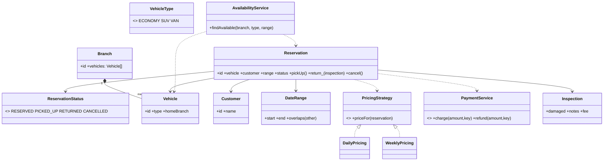

# Car Rental

A car rental system is an **availability** problem with a lifecycle on top. The pressure is not the catalog; it is that **a vehicle is never reserved twice for overlapping dates**, that pricing is deterministic, and that the messy real-world return (late, damaged) is handled without corrupting availability.

This follows the [8-phase LLD path](index.md): requirements → entities → responsibilities → relationships/interfaces → class diagram → core flows → critical code → edge cases/extensibility.

## 1. Requirements / Use Cases

Clarify, then scope explicitly.

Questions worth asking:

- Vehicles by category (economy, SUV, van) and by branch?
- Reservations for a date range, or open-ended rentals?
- Pickup/return at the same branch, or one-way?
- How is the price computed — daily, weekly, with a late fee?
- Damage inspection on return?

In scope for this design:

1. A **fleet** of vehicles in categories at a branch.
2. **Reserve** a vehicle for a date range (start, end).
3. **Pick up** and **return** a reservation.
4. **Price** by a rate plan; a **late return** adds overage; a **damaged** return adds a fee.
5. Never double-book a vehicle for overlapping dates.

Non-functional assumptions:

- **Invariant 1:** a vehicle has at most one active reservation for any date.
- **Invariant 2:** pricing is deterministic — the same reservation always prices the same.
- **Invariant 3:** availability is consistent — a reserved vehicle is not offered to someone else.

Out of scope: one-way rentals, loyalty pricing, insurance products, and fuel policies.

## 2. Core Entities

Objects with identity:

- `Branch` — a location with a fleet.
- `Vehicle` — a physical car (id, category, home branch).
- `Customer` — the renter.
- `Reservation` — a booking for a vehicle over a date range, with a lifecycle.
- `Inspection` — the return condition report.
- `AvailabilityService` — finds an available vehicle for a category/period.
- `PricingStrategy` — computes the price.
- `PaymentService` — the payment boundary.

Value objects and enums:

- `DateRange`, `Money`, `VehicleType` (`ECONOMY | SUV | VAN`), `ReservationStatus` (`RESERVED | PICKED_UP | RETURNED | CANCELLED`).

Abstractions (from the requirements):

- `PricingStrategy` — daily, weekly, seasonal.
- `PaymentService` — charge/refund.
- `AvailabilityService` — the overlap check and assignment.

## 3. Responsibilities

Assign each behavior to the class that owns the state it needs.

| Class | Owns / is responsible for |
|---|---|
| `Branch` | Its fleet of vehicles. |
| `Vehicle` | Its identity and category; it does **not** know about reservations. |
| `AvailabilityService` | The overlap check and choosing a free vehicle — this is where the no-double-booking invariant lives. |
| `Reservation` | The booking record and its lifecycle status. |
| `PricingStrategy` | Turning a reservation into a price. |
| `Inspection` | The return condition (damage notes). |
| `PaymentService` | Charging and refunding. |

Deliberately *not* placed:

- Overlap logic inside `Vehicle` or `Branch`. A vehicle is a thing; availability is a query over reservations.
- Pricing inside `Reservation`. The record does not compute money.
- Late-fee rules inside `Inspection`. Inspection reports condition; pricing applies the policy.

## 4. Relationships + Interfaces

is-a / has-a / uses-a, then interfaces at the points likely to change.

Relationships:

- `Branch` **has many** `Vehicle`.
- `Reservation` **references** a `Vehicle`, a `Customer`, and a `DateRange`.
- `AvailabilityService` **reads** reservations and **returns** a `Vehicle`.
- `Inspection` **belongs to** a `Reservation`.

Interfaces — discovered from requirements that will change:

- "How is the price computed?" varies (daily, weekly, seasonal) → **`PricingStrategy`**.
- "How is it paid?" varies → **`PaymentService`**.
- "How do we find a free car?" may vary (any car, same category, upgrade) → **`AvailabilityService`**.

```txt
interface PricingStrategy
  priceFor(reservation: Reservation) -> Money

interface PaymentService
  charge(amount: Money, key: string) -> PaymentResult
  refund(amount: Money, key: string) -> PaymentResult

interface AvailabilityService
  findAvailable(branch: Branch, type: VehicleType, range: DateRange) -> Vehicle | null
```

The **State pattern** falls out of the reservation lifecycle; the **Strategy pattern** falls out of pricing. The overlap rule is a domain invariant, not a pattern.

## 5. Class Diagram



Important methods (not every getter):

- `Reservation`: `pickUp()`, `return_(inspection)`, `cancel()`, `isActive()`.
- `AvailabilityService`: `findAvailable(branch, type, range)`.
- `DateRange`: `overlaps(other)`.
- `PricingStrategy`: `priceFor(reservation)`.

## 6. Core Flows

Execute the use cases through the objects.

Reserve:

```text
Customer requests SUV, Jun 10–14 at Branch 1
    ↓
AvailabilityService.findAvailable(branch, SUV, range)
    ↓
for each SUV at the branch:
    if no active reservation overlaps range → return this vehicle
    ↓
Reservation created (vehicle, customer, range, status = RESERVED)
    ↓
PricingStrategy.priceFor(reservation) → quote
```

Pick up and return:

```text
Reservation.pickUp()  → status = PICKED_UP
    ↓
... customer uses the car ...
    ↓
Reservation.return_(inspection)
    ↓
Inspection records condition (damaged? notes)
    ↓
price = PricingStrategy.priceFor(reservation)
      + overage (if returned late)
      + inspection.fee (if damaged)
    ↓
PaymentService.charge(price) → status = RETURNED
```

Overlap check (the invariant):

```text
DateRange.overlaps(a, b):
  return a.start < b.end and b.start < a.end      // half-open intervals
```

State transition table:

| State | Action | Next | Guard |
|---|---|---|---|
| — | reserve | `RESERVED` | no overlapping active reservation |
| `RESERVED` | pickUp | `PICKED_UP` | within pickup window |
| `PICKED_UP` | return_(inspection) | `RETURNED` | payment settled |
| `RESERVED` | cancel | `CANCELLED` | before pickup |
| `RETURNED` | — | terminal | — |

## 7. Implement Critical Code

Implement the overlap check, the availability search, and the return pricing; skip CRUD.

```txt
class DateRange
  overlaps(other):
    return this.start < other.end and other.start < this.end   // [start, end)

class AvailabilityService
  findAvailable(branch, type, range):
    candidates = branch.vehicles where vehicle.type == type
    active = reservations where status in {RESERVED, PICKED_UP}
    for v in candidates:
      if none(r in active where r.vehicle == v and r.range.overlaps(range)):
        return v
    return null

class Reservation
  return_(inspection):
    if status != PICKED_UP: raise InvalidTransition
    base = pricing.priceFor(this)
    overage = lateDays(this.range, actualReturnDate()) * dailyRate(this.vehicle.type)
    total = base + overage + inspection.fee
    payment.charge(total, idempotencyKey = this.id)
    this.status = RETURNED
    return Receipt(total)

class WeeklyPricing implements PricingStrategy
  priceFor(reservation):
    days = reservation.range.days()
    rate = dailyRate(reservation.vehicle.type)
    if days >= 7: return rate * days * 0.9       // weekly discount
    return rate * days
```

## 8. Edge Cases + Extensibility + Wrap-Up

Attack your own design:

- **Two customers reserve the last car at once.** The availability check and the reservation insert must be atomic — a per-vehicle lock or a unique constraint on `(vehicle, date)` prevents the double booking.
- **Late return.** Charge overage per late day; the vehicle's next reservation may be affected — flag the conflict.
- **Damaged return.** Add the inspection fee and mark the vehicle out of service until repaired.
- **Cancellation and refund.** `CANCELLED` frees the dates; refund per policy.
- **Extension.** Extending a reservation is a new overlap check for the extra days; if the next renter exists, refuse or reassign.
- **Clock/timezone.** Date ranges use the branch's local day boundaries; store dates, not instants, for rental days.

Then say how change is absorbed — the part the interviewer is listening for:

- **New pricing plan** (seasonal, weekend, loyalty) → add a `PricingStrategy`.
- **New vehicle category** → data in the fleet; fit rules unchanged.
- **One-way rental** → the reservation gains a return branch; availability spans two branches.
- **New payment provider** → a new `PaymentService`.

Concurrency, stated plainly: the shared mutable state is the **set of active reservations per vehicle**. The critical section is "check overlap, then insert"; make it atomic with a per-vehicle lock or a database constraint on overlapping ranges. The invariant under any interleaving: **no vehicle has two active reservations over overlapping dates**.

Trade-offs:

| Choice | Why | Alternative | Trade-off |
|---|---|---|---|
| Availability as a service/query | One place owns the overlap invariant | Store `isAvailable` on the vehicle | Simpler reads, but the flag drifts and races |
| Half-open date ranges | Adjacent rentals (ends 14th, starts 14th) don't conflict | Inclusive end dates | Off-by-one bugs at every boundary |
| Pricing as Strategy | Plans change often | Hard-code daily rate | Simpler, but every plan edits `Reservation` |
| Atomic assign | Prevents double booking at the source | Check then insert | Simpler code, but a race window |

## Interactive Visualizer

Book a car: pick a **category** and a **date range**, then **Reserve**. The timeline shows each vehicle's reservations; an overlapping request is refused and the service tries another car. **Pick up** and **Return** (with an optional late/damage flag) move a reservation through its lifecycle and price it. Press **▶ Play** to run bookings. Use the **design lens** to swap the **PricingStrategy** and the **overage policy**, and step through the **1–8** phase map.

<div
  id="car-rental-visualizer"
  class="crv car-rental-visualizer"
></div>

## Interview recap

The answer is: "a `Branch` owns vehicles; `Reservation` is a record with a lifecycle; `AvailabilityService` owns the no-overlap invariant and assigns a vehicle; and pricing, overage, and payment are replaceable policies."

Likely follow-ups:

- Where exactly do you prevent two overlapping reservations on the same car?
- A customer returns a day late and the car is booked tomorrow — what happens?
- How would one-way rentals change the availability model?
- Why keep `isAvailable` off the `Vehicle` object?
