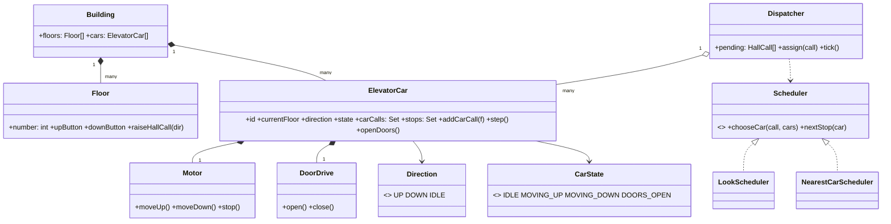

# Elevator

An elevator is a small set of cars sharing one building, and the whole design funnels into two decisions: **which car answers a call**, and **in what order a car visits floors**. It is the classic low-level design because it forces you to separate policy (scheduling) from state (the car), protect a safety invariant, and reason about concurrency — all without any distributed-systems vocabulary.

This is an interview scope, not a product claim. It covers one building with N floors and M cars, hall calls, car calls, safe movement, and a schedulable order of stops. Door hardware, emergency protocols, and destination-dispatch input devices are extensions.

## 1. Clarify requirements

Functional requirements:

- A passenger on a floor presses **Up** or **Down**; the request joins a shared hall-call queue.
- A passenger inside a car presses a **destination floor**; the request joins that car's car-call set.
- Each car moves one floor at a time, stops only at floors it must serve, opens doors, exchanges passengers, and continues.
- Buttons light while their request is pending and clear when served.
- The system favors lower wait time and no starvation, but safety always wins.

Non-functional requirements (interview assumptions):

- **Safety invariant:** a car never moves with its doors open, and never opens doors while moving.
- **No starvation:** every hall call is eventually served, even under continuous demand.
- **Determinism for review:** given the same calls, the same schedule can be reproduced.
- Scale assumptions: one building, 8–64 floors, 2–8 cars, tens of calls per minute. No cross-building dispatch.

Explicitly out of scope: motor/brake control, door-obstruction sensors, fire-service mode, and destination-dispatch kiosks (kept as extensions).

## 2. Identify entities

Objects with identity:

- `ElevatorCar` — a physical car with its own floor, direction, door state, and outstanding stops.
- `Floor` — a landing with a number and hall buttons.
- `Building` — owns floors and cars; bounds the simulation.
- `Dispatcher` — assigns hall calls to cars and drives the tick loop.

Value objects and enums:

- `Direction` = `UP | DOWN | IDLE`.
- `CarState` = `IDLE | MOVING_UP | MOVING_DOWN | DOORS_OPEN`.
- `HallCall(floor, direction)` — a request raised at a landing.
- `CarCall(destinationFloor)` — a request raised inside a car.
- `Stop` — a scheduled floor visit that may satisfy hall and/or car calls.

Hardware/infrastructure abstractions (so the model is not welded to a motor):

- `Motor` (move up/down/stop), `DoorDrive` (open/close), `PanelButtons`, `Display`.

## 3. Define relationships

- A `Building` **composes** many `Floor`s and `ElevatorCar`s.
- An `ElevatorCar` **composes** one `Motor` and one `DoorDrive`, and **holds** a set of `CarCall`s and the `HallCall`s assigned to it.
- A `Floor` **owns** its up/down button state and raises `HallCall`s.
- A `Dispatcher` **references** all cars and the shared pending hall calls; it depends on a `Scheduler` abstraction, not on a concrete policy.
- `Scheduler` **associates** with cars to rank them; it does not own car state.



## 4. Define interfaces and abstractions

The two things most likely to change are **which car answers** and **how a car orders its stops**. Both become interfaces:

```txt
interface Scheduler
  chooseCar(call: HallCall, cars: List<ElevatorCar>) -> ElevatorCar
  nextStop(car: ElevatorCar) -> Optional<Stop>      // policy for ordering visits

interface Motor
  moveUp(); moveDown(); stop()

interface DoorDrive
  open(); close()
```

- `LookScheduler` implements the elevator `LOOK` policy: serve every request in the current direction, then reverse.
- `NearestCarScheduler` is a simpler baseline used to compare wait time.
- `Motor` and `DoorDrive` keep the car testable with fakes and let a real building swap hardware.

## 5. Design classes

Core state and operations:

```txt
class ElevatorCar
  id: string
  currentFloor: int
  direction: Direction = IDLE
  state: CarState = IDLE
  carCalls: Set<int>            // destinations entered inside the car
  hallCalls: List<HallCall>     // hall calls assigned to this car
  doorOpenTicks: int            // > 0 while dwelling

  addCarCall(floor)
  addHallCall(call)
  shouldStopHere() -> bool
  step()                        // advance exactly one tick of the simulation
  floorsToServe() -> Set<int>

class Dispatcher
  cars: List<ElevatorCar>
  scheduler: Scheduler
  pending: Set<HallCall>

  raiseHallCall(floor, direction)
  tick()                        // assigns pending calls, then steps every car
```

## 6. Decide responsibilities

- The **`ElevatorCar` owns its own safety**: it is the only object allowed to change `currentFloor`, `state`, and door state, and it must never move while doors are open.
- The **`Dispatcher` owns assignment and fairness**: it decides which car takes a hall call so that no car is overloaded and no call starves.
- The **`Scheduler` owns policy only**: given cars and calls, it ranks cars and orders stops. It holds no mutable car state.
- A **`Floor` owns only its buttons**; it does not know which car will answer.

Deliberately *not* placed:

- Scheduling inside `ElevatorCar` — that welds policy to state and makes "try a new policy" a risky edit.
- A single `ElevatorSystem` God class that reaches into every car's fields — it centralizes coupling and hides the invariant.
- Door timing inside `Motor` — motion and door interlocks are separate safety concerns that must be cross-checked.

## 7. Apply design patterns where useful

- **State** for `CarState`. Behavior differs per state: `IDLE` waits for a stop, `MOVING_UP/DOWN` advance one floor, `DOORS_OPEN` counts down and exchanges passengers. This removes long `if/else` chains and makes the "never move with doors open" rule a transition guard.
- **Strategy** for `Scheduler`. Swapping `LOOK`, nearest-car, or destination-dispatch becomes a constructor argument, not a rewrite.
- **Observer** for lamps and displays. Button lamps and floor indicators subscribe to request and arrival events instead of the car hard-coding UI updates.
- **Command** (optional) for button presses. Treating `HallCall`/`CarCall` as small command objects makes deduplication, logging, and replay straightforward.

Cost: each pattern adds indirection. Use State and Strategy because they clearly pay off; skip Command unless replay or audit is a stated requirement.

## 8. Handle important workflows

Main path — a hall call above a car moving up:

| # | Actor | Action | State change |
|---|---|---|---|
| 1 | Passenger (floor 5) | presses Up | `HallCall(5, UP)` raised |
| 2 | Dispatcher | `chooseCar` | picks the car moving up that is below floor 5, or the nearest idle car |
| 3 | Car | accepts call | `hallCalls += (5, UP)`; direction stays `UP` |
| 4 | Car | `step()` repeatedly | `MOVING_UP`, floor advances one at a time |
| 5 | Car | arrives at 5 | `DOORS_OPEN`; hall call cleared; lamp off |
| 6 | Passenger | presses 9 | `CarCall(9)` added; car continues `MOVING_UP` |
| 7 | Car | arrives at 9 | `DOORS_OPEN`; car call cleared |
| 8 | Car | no stops above | reverses to `DOWN`, or becomes `IDLE` at the top |

Alternative path: a new `HallCall(7, UP)` arrives while the car is between 5 and 9. Because `7` is still in the current `UP` direction, `LOOK` inserts it and the car serves it on the way up — no detour, no extra reversal.

State transition table:

| From | Event | To | Guard |
|---|---|---|---|
| `IDLE` | stop scheduled | `MOVING_UP`/`MOVING_DOWN` | doors closed |
| `MOVING_UP` | next floor is a stop | `DOORS_OPEN` | doors closed |
| `DOORS_OPEN` | dwell elapsed | `MOVING_UP`/`MOVING_DOWN`/`IDLE` | no obstruction |
| `MOVING_UP` | no stops above, stops below | `MOVING_DOWN` | doors closed |
| any moving | door sensor trip | `DOORS_OPEN` | emergency stop first |

## 9. Handle edge cases

- **Duplicate press:** the same `HallCall(floor, dir)` is raised twice — the pending set dedupes it, so the lamp stays on once.
- **Invalid transition:** a request to move while `DOORS_OPEN` is refused by the transition guard; this is the safety invariant, not a nicety.
- **Car full:** at a stop the car skips boarding but still clears the hall call only if it can actually take passengers; otherwise it re-queues so the call is not lost.
- **Top/bottom reversal:** at the highest floor an `UP`-only car must not oscillate; with no stops above it reverses or idles.
- **No available car:** every car busy — the call stays pending and is assigned to the first car that becomes eligible; fairness prevents starvation.
- **Door obstruction:** the dwell timer restarts and the door reopens; the car keeps the same intended direction.
- **Emergency/priority:** a fire-service or manual override transitions to a safe state independently of the normal schedule.

## 10. Discuss extensibility

- **New scheduling policy:** implement `Scheduler` (`DestinationDispatchScheduler`, `EnergySaverScheduler`) and pass it to the `Dispatcher`. No car code changes.
- **New car type:** a freight car with different capacity and door timing is another `ElevatorCar` configuration; the `Building` composes it the same way.
- **More floors or cars:** both are data in `Building`; the schedule and the visualization scale without a redesign.
- **Different hardware:** a new `Motor`/`DoorDrive` adapter is swapped in behind the same interfaces, so the simulation and tests keep working.
- **Priority handling:** VIP or service modes add an eligibility rule to the scheduler rather than branching inside the car.

## 11. Discuss concurrency where relevant

The shared mutable state is the **pending hall-call set**, each car's **floor/direction/state**, and the **door interlock**.

- The simplest correct model is a **single-threaded control loop**: one `Dispatcher.tick()` that assigns calls and advances every car. No locks are needed because there is one writer.
- In a real system with per-car controllers, each car has a lock; the interlock that checks "doors closed before move" must be atomic with the move command. Lock ordering is fixed (car state before shared queue) to avoid deadlock.
- Button events are the concurrent producers; the queue is the single synchronization point. Treating a press as an idempotent `HallCall` command makes double-delivery harmless.
- The invariant that must never be violated: **a non-zero velocity implies doors closed**, for every car, under every interleaving.

## 12. Write the core class/pseudocode design

```txt
class ElevatorCar
  step():
    if doorOpenTicks > 0:
      doorOpenTicks -= 1
      if doorOpenTicks == 0: doors.close(); state = directionState()
      return

    if shouldStopHere():
      doors.open(); state = DOORS_OPEN; doorOpenTicks = DWELL
      serveThisFloor()                 // clear hall + car calls, board new passengers
      return

    target = nextTarget()              // nearest stop in current direction
    if target == null:
      target = nextTarget(opposite(direction))
      if target == null: direction = IDLE; state = IDLE; return
      direction = opposite(direction)

    motor.moveToward(target)           // guarded: doors are closed here
    currentFloor += (direction == UP ? 1 : -1)
    state = (direction == UP ? MOVING_UP : MOVING_DOWN)

  nextTarget(dir):                     // LOOK: nearest floor ahead in dir
    candidates = floorsToServe() filtered by (dir == UP ? floor > currentFloor : floor < currentFloor)
    return nearest(candidates) or null

class LookScheduler implements Scheduler
  chooseCar(call, cars):
    best = null
    for car in cars:
      score = distance(car, call)
      if car.direction == call.direction and approaching(car, call): score -= BONUS
      if car.direction == opposite(call.direction): score += PENALTY
      if car.idle: score += IDLE_PENALTY
      best = min(best, score, car)
    return best
```

## 13. Discuss trade-offs

| Choice | Why | Alternative | Trade-off |
|---|---|---|---|
| `LOOK` scheduling | Serves all traffic in one direction before reversing — few reversals, low average travel | Nearest-car per call | Lower average trip but more direction reversals and worse high-load behavior |
| Dispatcher owns assignment | Keeps fairness and load balancing in one place | Each car grabs calls | Contention and duplicated work; harder to guarantee no starvation |
| State pattern for the car | Makes the safety invariant a transition guard | Free-form flags | Simpler at first, but the "moving with doors open" bug becomes reachable |
| Single-threaded tick | Trivially correct, reproducible, easy to test | Per-car threads with locks | Higher throughput, but lock ordering and interlock bugs |
| Scheduler as strategy | Policy changes are isolated | Hard-coded policy | One more abstraction for very small systems |

## Interactive Visualizer

Watch the scheduler work: press a floor's **▲/▼** button to raise a hall call, then step or play. Each car shows its state machine and direction; the caption explains *why* a car was chosen and where it will stop next.

<div
  id="elevator-visualizer"
  class="elv elevator-visualizer"
></div>

## Interview recap

The answer is: "a car owns its own safe state and the stops assigned to it; a dispatcher owns assignment and fairness; a pluggable scheduler owns the ordering policy; and a single tick advances every car one step at a time."

Likely follow-ups:

- Why does `LOOK` usually beat nearest-car under load, and where does it lose?
- How do you guarantee no hall call starves when demand is continuous?
- Where exactly is the lock (or the single writer) that protects "never move with doors open"?
- How would destination dispatch change the entities and the scheduler interface?
