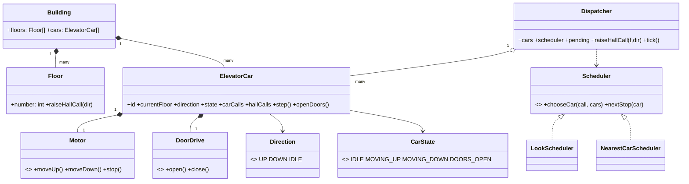

# Elevator

An elevator is a small set of cars sharing one building, and the whole design funnels into two decisions: **which car answers a call**, and **in what order a car visits floors**. It is the classic low-level design because it forces you to separate policy (scheduling) from state (the car), protect a safety invariant, and reason about concurrency — all without any distributed-systems vocabulary.

This follows the [8-phase LLD path](index.md): requirements → entities → responsibilities → relationships/interfaces → class diagram → core flows → critical code → edge cases/extensibility.

## 1. Requirements / Use Cases

Clarify, then scope explicitly.

Questions worth asking:

- How many floors and how many cars?
- Hall buttons (floor + direction) and in-car destination buttons?
- Should the system minimize wait time, travel distance, or both?
- Is fairness (no starvation) required?
- Any VIP/freight priority, or emergency service?

In scope for this design:

1. A building with **N floors and M cars**.
2. A passenger raises a **hall call** (floor + direction) at a landing.
3. A passenger raises a **car call** (destination floor) inside a car.
4. Cars move one floor at a time, stop only where needed, open doors, exchange passengers, continue.
5. Buttons light while pending and clear when served.
6. The scheduler favors low wait time and no starvation.

Non-functional assumptions:

- **Safety invariant:** a car never moves with its doors open, and never opens doors while moving.
- **No starvation:** every hall call is eventually served, even under continuous demand.
- **Determinism:** the same calls produce the same schedule, which makes review and testing possible.
- Scale: one building, 8–64 floors, 2–8 cars, tens of calls per minute.

Out of scope: motor/brake control, door-obstruction sensors, fire-service mode, and destination-dispatch kiosks (kept as extensions).

## 2. Core Entities

Look for the nouns, and separate objects with identity from value objects.

Objects with identity:

- `ElevatorCar` — a physical car with its own floor, direction, door state, and stops.
- `Floor` — a landing with a number and hall buttons.
- `Building` — owns the floors and cars; bounds the simulation.
- `Dispatcher` — assigns hall calls to cars and drives the tick loop.

Value objects and enums:

- `Direction` = `UP | DOWN | IDLE`.
- `CarState` = `IDLE | MOVING_UP | MOVING_DOWN | DOORS_OPEN`.
- `HallCall(floor, direction)` — a request raised at a landing.
- `CarCall(destinationFloor)` — a request raised inside a car.

Hardware abstractions (so the model is not welded to a motor):

- `Motor` (move up / move down / stop), `DoorDrive` (open / close), and button/display panels.

Do not invent 25 classes up front — start with the domain objects the requirements actually need.

## 3. Responsibilities

Ask *"who should own this behavior?"* for each action. Assign behavior to the class that already owns the state it needs.

| Class | Owns / is responsible for |
|---|---|
| `ElevatorCar` | Its own floor, direction, door state, and the stops assigned to it. It is the only object allowed to change them. |
| `Dispatcher` | Assignment and fairness: which car takes a hall call, so no car is overloaded and no call starves. |
| `Scheduler` | Policy only: given cars and calls, it ranks cars and orders stops. It holds no mutable car state. |
| `Floor` | Only its own buttons. It never knows which car will answer. |

Deliberately *not* placed:

- Scheduling inside `ElevatorCar` — that welds policy to state and makes "try a new policy" a risky edit.
- A single `ElevatorSystem` God class that reaches into every car's fields — it centralizes coupling and hides the invariant.
- Door timing inside `Motor` — motion and door interlocks are separate safety concerns that must be cross-checked.

This is the phase most candidates skip; it is where the design is actually won.

## 4. Relationships + Interfaces

Decide is-a / has-a / uses-a, then introduce interfaces at the points likely to change.

Relationships:

- `Building` **has many** `Floor`s and `ElevatorCar`s (composition).
- `ElevatorCar` **has** a `Motor` and a `DoorDrive` (composition).
- `Dispatcher` **uses** many `ElevatorCar`s (aggregation) and **depends on** a `Scheduler`.
- `Floor` **raises** `HallCall`s.

Interfaces — discovered from the requirements, not announced:

- Different assignment policies are possible → fee-like replaceability for scheduling → **`Scheduler`**.
- Real hardware must be swappable and testable → **`Motor`**, **`DoorDrive`**.
- Car behavior differs per state, and "moving with doors open" must be unreachable → **`CarState`** as a State.

```txt
interface Scheduler
  chooseCar(call: HallCall, cars: List<ElevatorCar>) -> ElevatorCar
  nextStop(car: ElevatorCar) -> Optional<Stop>

interface Motor
  moveUp(); moveDown(); stop()

interface DoorDrive
  open(); close()
```

`LookScheduler` implements the `LOOK` policy (serve everything in the current direction, then reverse); `NearestCarScheduler` is a simpler baseline used to compare wait time. Both are Strategy implementations of `Scheduler`.

## 5. Class Diagram

With responsibilities and interfaces decided, the diagram is mostly assembly.



Important methods (not every getter/setter):

- `ElevatorCar`: `step()`, `shouldStop()`, `serveFloor()`, `openDoors()`.
- `Dispatcher`: `raiseHallCall(f, dir)`, `assign()`, `tick()`.
- `Scheduler`: `chooseCar(call, cars)`, `nextStop(car)`.

## 6. Core Flows

Execute a requirement through the objects; this exposes bad designs fast.

Main flow — a hall call above a car moving up:

| # | Actor | Action | State change |
|---|---|---|---|
| 1 | Passenger (floor 5) | presses Up | `HallCall(5, UP)` raised |
| 2 | Dispatcher | `chooseCar` | picks the car moving up below 5, or the nearest idle car |
| 3 | Car | accepts call | `hallCalls += (5, UP)`; direction stays `UP` |
| 4 | Car | `step()` repeatedly | `MOVING_UP`, floor advances one at a time |
| 5 | Car | arrives at 5 | `DOORS_OPEN`; hall call cleared; lamp off |
| 6 | Passenger | presses 9 | `CarCall(9)` added; car continues `MOVING_UP` |
| 7 | Car | arrives at 9 | `DOORS_OPEN`; car call cleared |
| 8 | Car | no stops above | reverses to `DOWN`, or becomes `IDLE` at the top |

Alternative path: a new `HallCall(7, UP)` arrives while the car is between 5 and 9. Because 7 is still in the current `UP` direction, `LOOK` inserts it and the car serves it on the way up — no detour, no extra reversal.

State transition table:

| From | Event | To | Guard |
|---|---|---|---|
| `IDLE` | stop scheduled | `MOVING_UP`/`MOVING_DOWN` | doors closed |
| `MOVING_UP` | next floor is a stop | `DOORS_OPEN` | doors closed |
| `DOORS_OPEN` | dwell elapsed | `MOVING_UP`/`MOVING_DOWN`/`IDLE` | no obstruction |
| `MOVING_UP` | no stops above, stops below | `MOVING_DOWN` | doors closed |
| any moving | door sensor trip | `DOORS_OPEN` | emergency stop first |

If you cannot say which object calls which collaborator, the class design is not finished.

## 7. Implement Critical Code

Implement only the parts that contain real design decisions: the state transition, the policy boundary, and the assignment heuristic.

```txt
class ElevatorCar
  step():
    if doorOpenTicks > 0:
      doorOpenTicks -= 1
      if doorOpenTicks == 0: doors.close(); state = directionState()
      return

    if shouldStopHere():
      doors.open(); state = DOORS_OPEN; doorOpenTicks = DWELL
      serveThisFloor()                 // clear hall + car calls, board new passengers
      return

    target = nextTarget()              // nearest stop in current direction
    if target == null:
      target = nextTarget(opposite(direction))
      if target == null: direction = IDLE; state = IDLE; return
      direction = opposite(direction)

    motor.moveToward(target)           // guarded: doors are closed here
    currentFloor += (direction == UP ? 1 : -1)
    state = (direction == UP ? MOVING_UP : MOVING_DOWN)

  nextTarget(dir):                     // LOOK: nearest floor ahead in dir
    candidates = floorsToServe() filtered by (dir == UP ? floor > currentFloor : floor < currentFloor)
    return nearest(candidates) or null

class LookScheduler implements Scheduler
  chooseCar(call, cars):
    best = null
    for car in cars:
      score = distance(car, call)
      if car.direction == call.direction and approaching(car, call): score -= BONUS
      if car.direction == opposite(call.direction): score += PENALTY
      if car.idle: score += IDLE_PENALTY
      best = min(best, score, car)
    return best
```

The interviewer cares far more about these abstractions, responsibilities, dependencies, and invariants than about boilerplate.

## 8. Edge Cases + Extensibility + Wrap-Up

Attack your own design first:

- **Duplicate press:** the same `HallCall(floor, dir)` arrives twice — the pending set dedupes it; the lamp stays on once.
- **Invalid transition:** a move while `DOORS_OPEN` is refused by the transition guard — the safety invariant, not a nicety.
- **Car full:** at a stop the car may skip boarding but must re-queue the call so it is not lost.
- **Top/bottom reversal:** an `UP`-only car must not oscillate at the top; it reverses or idles.
- **No available car:** every car busy — the call stays pending and is assigned to the first eligible car; fairness prevents starvation.
- **Door obstruction:** the dwell restarts and the door reopens, keeping the intended direction.
- **Emergency/priority:** fire-service or manual override transitions to a safe state independently of the schedule.

Then say how change is absorbed — the answer the interviewer is listening for:

- **New scheduling policy** → add a `Scheduler` implementation; pass it to the `Dispatcher`. No car changes.
- **New car type** (freight, VIP) → another `ElevatorCar` configuration; `Building` composes it the same way.
- **More floors or cars** → data in `Building`; the schedule and the class model scale unchanged.
- **Different hardware** → new `Motor`/`DoorDrive` adapters behind the same interfaces; tests keep working.

Concurrency, stated as part of the wrap-up: the shared mutable state is the pending hall-call set, each car's floor/direction/state, and the door interlock. The simplest correct model is a **single-threaded control loop** — one `Dispatcher.tick()` that assigns calls and advances every car, so no locks are needed. With per-car controllers, each car has a lock and the door/motor interlock must be atomic with the move; lock ordering is fixed to avoid deadlock. The invariant that must hold under every interleaving: **a non-zero velocity implies doors closed**.

Trade-offs:

| Choice | Why | Alternative | Trade-off |
|---|---|---|---|
| `LOOK` scheduling | Serves all traffic in one direction before reversing — few reversals, low average travel | Nearest-car per call | Lower single-trip time but more reversals and worse under load |
| Dispatcher owns assignment | Keeps fairness and load balancing in one place | Each car grabs calls | Contention and duplicated work; starvation becomes possible |
| State pattern for the car | Makes the safety invariant a transition guard | Free-form boolean flags | Simpler initially, but "moving with doors open" becomes reachable |
| Single-threaded tick | Trivially correct, reproducible, testable | Per-car threads with locks | Higher throughput, but lock-ordering and interlock bugs |

## Interactive Visualizer

Watch the scheduler work, then flip the design: press a floor's **▲/▼** to raise a hall call, step or play, and use the **design lens** below the building. The lens shows the class model, who owns what, the live call trace, and — the point of the whole design — a **Scheduler swap (LOOK ↔ nearest-car)** you can run to see the metric change. The **1–8** chips map each phase of the LLD path to the classes that are your evidence.

<div
  id="elevator-visualizer"
  class="elv elevator-visualizer"
></div>

## Interview recap

The answer is: "a car owns its own safe state and the stops assigned to it; a dispatcher owns assignment and fairness; a pluggable scheduler owns the ordering policy; and a single tick advances every car one step at a time."

Likely follow-ups:

- Why does `LOOK` usually beat nearest-car under load, and where does it lose?
- How do you guarantee no hall call starves when demand is continuous?
- Where exactly is the lock (or the single writer) that protects "never move with doors open"?
- How would destination dispatch change the entities and the scheduler interface?
