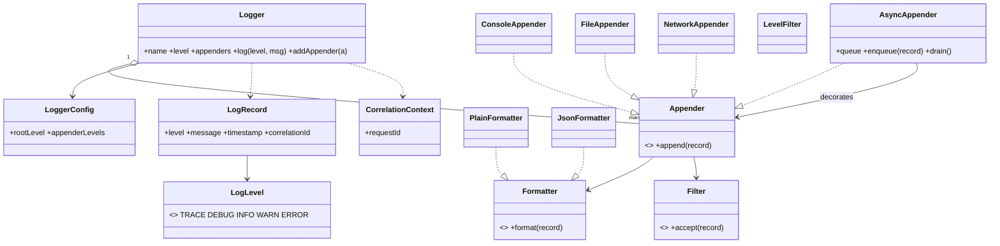

# Logger

A logging library is a **pipeline with a hot path**. The pressure is that logging must be cheap on the caller's thread, filterable per sink, formattable in different ways, and must neither block nor silently lose everything under load. It is the canonical **Chain of Responsibility** plus **Strategy** problem.

This follows the [8-phase LLD path](index.md): requirements → entities → responsibilities → relationships/interfaces → class diagram → core flows → critical code → edge cases/extensibility.

## 1. Requirements / Use Cases

Clarify, then scope explicitly.

Questions worth asking:

- Which levels — TRACE, DEBUG, INFO, WARN, ERROR?
- One sink or many (console, file, network)?
- Per-sink level thresholds, or one global level?
- Is logging synchronous or asynchronous?
- Configurable format, and per-request correlation ids?

In scope for this design:

1. Log at **levels**, with a **per-logger threshold** and **per-sink thresholds**.
2. Fan a record out to **multiple sinks** (console, file, network).
3. **Format** records (plain text or JSON).
4. **Asynchronous** logging that does not block the caller.
5. **Correlation context** (a request id) attached to records.

Non-functional assumptions:

- **Invariant 1:** the caller's thread does no I/O on the hot path when async is on.
- **Invariant 2:** level filtering is exact — a record below a threshold never reaches that sink.
- **Invariant 3:** under pressure the queue applies a stated policy (drop or block); it does not grow without bound.

Out of scope: log shipping/rotation internals, sampling, and remote config services.

## 2. Core Entities

Objects with identity:

- `Logger` — the entry point the application calls.
- `LogRecord` — one event (level, message, timestamp, correlation id).
- `Appender` (handler) — writes to one sink.
- `Formatter` (layout) — renders a record to a string.
- `Filter` — decides whether a record passes.
- `AsyncAppender` — a queue + worker that decorates a target appender.
- `LoggerConfig` — levels and appender wiring.
- `CorrelationContext` — the request id.

Value objects and enums:

- `LogLevel` = `TRACE < DEBUG < INFO < WARN < ERROR`.
- `Money`-like value: none here; `LogRecord` is a value.

Abstractions (from the requirements):

- `Appender` — the sink varies (Strategy/Chain).
- `Formatter` — the format varies (Strategy).
- `Filter` — the predicate varies.

## 3. Responsibilities

Assign each behavior to the class that owns the state it needs.

| Class | Owns / is responsible for |
|---|---|
| `Logger` | The entry point: applying its level threshold and handing a record to its appenders. |
| `LogRecord` | The immutable event data. |
| `Appender` | Writing to **one** sink, with its own threshold and formatter. |
| `Formatter` | Turning a record into a string. |
| `Filter` | Deciding pass/fail for a record. |
| `AsyncAppender` | The bounded queue and the worker that drains it. |
| `LoggerConfig` | Wiring levels and appenders. |

Deliberately *not* placed:

- Formatting inside `Logger`. The logger routes; the formatter renders.
- All sink logic inside one `Logger` class. Each sink is an appender in a chain.
- Queue management inside `Appender`. Async is a decorator around an appender, not the appender's job.

## 4. Relationships + Interfaces

is-a / has-a / uses-a, then interfaces at the points likely to change.

Relationships:

- `Logger` **has many** `Appender`s and **has** a `LoggerConfig`.
- An `Appender` **has** a `Formatter` and a `Filter`.
- `AsyncAppender` **decorates** a target `Appender`.
- `LogRecord` **references** a `LogLevel`.

Interfaces — discovered from requirements that will change:

- "Where do logs go?" varies (console, file, network) → **`Appender`**.
- "How is a record rendered?" varies (plain, JSON) → **`Formatter`**.
- "What passes?" varies (level, substring, sampling) → **`Filter`**.

```txt
interface Appender
  append(record: LogRecord)

interface Formatter
  format(record: LogRecord) -> string

interface Filter
  accept(record: LogRecord) -> boolean
```

The **Chain of Responsibility** falls out of "a record is offered to each appender in turn"; the **Strategy pattern** falls out of the format varying; **Decorator** falls out of adding async without changing appenders.

## 5. Class Diagram



Important methods (not every getter):

- `Logger`: `log(level, message)`, `addAppender(a)`.
- `Appender`: `append(record)`.
- `Formatter`: `format(record)`.
- `AsyncAppender`: `enqueue(record)`, `drain()`.

## 6. Core Flows

Execute the use cases through the objects.

Synchronous log:

```text
Logger.log(INFO, "user 42 logged in")
    ↓
if INFO < logger.level → return            // cheap early exit
    ↓
record = LogRecord(INFO, msg, now, correlationId)
    ↓
for appender in appenders:                 // Chain of Responsibility
    if appender.level <= record.level and appender.filter.accept(record):
        line = appender.formatter.format(record)
        appender.write(line)               // I/O on the caller's thread
```

Asynchronous log:

```text
Logger.log(INFO, msg)
    ↓
AsyncAppender.enqueue(record)              // returns immediately
    ↓
if queue full: apply policy (drop-oldest | block)
    ↓
worker thread: record = queue.take(); target.append(record)   // I/O off the hot path
```

Level filtering:

```text
logger.level = INFO, appender(File).level = WARN
log(DEBUG) → below logger → dropped
log(INFO)  → passes logger, below File → console only
log(ERROR) → passes both → console + file
```

State table (per record, per appender):

| Record level | Logger (INFO) | Console (INFO) | File (WARN) |
|---|---|---|---|
| DEBUG | drop | — | — |
| INFO | pass | write | drop |
| ERROR | pass | write | write |

## 7. Implement Critical Code

Implement the entry point, the chain, the formatter, and the async queue; skip config parsing.

```txt
class Logger
  log(level, message):
    if level < this.level: return                    // fast reject on the hot path
    record = LogRecord(level, message, now(), CorrelationContext.current())
    for a in appenders: a.append(record)             // chain; each appender self-filters

class Appender
  append(record):
    if record.level < this.level: return
    if filter and not filter.accept(record): return
    write(formatter.format(record))

class JsonFormatter implements Formatter
  format(record):
    return json({ ts: record.timestamp, level: record.level.name,
                  msg: record.message, req: record.correlationId })

class AsyncAppender implements Appender
  queue: BoundedQueue(maxSize)
  target: Appender
  policy: "drop-oldest" | "block"

  append(record):
    if queue.full():
      if policy == "drop-oldest": queue.dropOldest(); dropped += 1
      else: queue.waitForSpace()                     // backpressure on the caller
    queue.put(record)

  drain():                                           // worker thread
    while running: target.append(queue.take())
```

## 8. Edge Cases + Extensibility + Wrap-Up

Attack your own design:

- **Queue full under load.** Drop-oldest keeps the hot path non-blocking but loses logs; block applies backpressure but can stall the caller. State the policy and make it configurable.
- **Slow sink.** A slow file/network appender must not stall other appenders — isolate it behind its own async queue.
- **Reentrancy.** Logging from inside a formatter or appender can recurse; guard with a thread-local flag or forbid it.
- **Config reload at runtime.** Swap levels/appenders atomically; in-flight records use the config captured at call time.
- **Clock and correlation.** Use a monotonic clock for ordering; correlation id comes from the request context, not the logger.
- **Formatting cost.** Formatting is expensive; format on the worker thread, not the caller.

Then say how change is absorbed — the part the interviewer is listening for:

- **New sink** (syslog, cloud) → add an `Appender`.
- **New format** (logfmt, CSV) → add a `Formatter`.
- **New filter** (sampling, redaction) → add a `Filter`.
- **New transport policy** → a new queue/drop strategy; appenders are unchanged.

Concurrency, stated plainly: many threads call `log()`; the shared state is the **bounded queue**. Producers enqueue and the worker dequeues; the queue is the single synchronization point. In the synchronous path, each appender must be thread-safe (lock or lock-free writer). The invariant under any interleaving: **a record is written whole to each sink, or dropped whole — never interleaved or partially written**.

Trade-offs:

| Choice | Why | Alternative | Trade-off |
|---|---|---|---|
| Chain of Responsibility for appenders | Add/remove sinks without touching `Logger` | One logger writing to all sinks | Simple, but every new sink edits the logger |
| Async decorator | Non-blocking hot path | Synchronous writes | Simpler, but I/O latency hits the caller |
| Bounded queue + drop policy | Predictable memory | Unbounded queue | Never drops, but can OOM |
| Formatter as Strategy | JSON vs plain per sink | Hard-coded format | Simpler, but not per-sink configurable |

## Interactive Visualizer

Emit logs and watch the pipeline: **Logger → level filter → async queue → Console / File / Network**, each sink with its own threshold and formatter. Records below a threshold are dropped; the sink panels show the formatted output. Toggle **async**, fill the queue, and switch the **drop policy**. Use the **design lens** to swap the **Formatter** and the **drop policy**, inspect responsibilities, and step through the **1–8** phase map.

<div
  id="logger-visualizer"
  class="lgv logger-visualizer"
></div>

## Interview recap

The answer is: "`Logger` routes; each `Appender` in a chain owns one sink, its threshold, and its formatter; formatting and filtering are strategies; and an `AsyncAppender` decorates a sink with a bounded queue so the hot path never blocks."

Likely follow-ups:

- How do you keep logging off the caller's critical path?
- The queue is full — drop or block, and why?
- How do you add a new sink or format without editing `Logger`?
- What breaks if a formatter itself logs?
