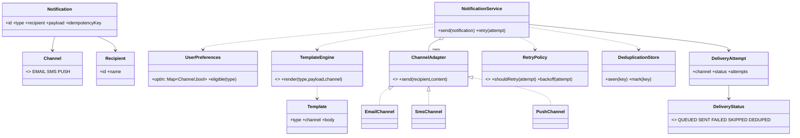

# Notification System

A notification system is a **fan-out pipeline with policy**. The pressure is not sending a message; it is respecting who wants what on which channel, rendering the right content, delivering across unreliable providers, retrying without duplicating, and staying inside provider limits.

This follows the [8-phase LLD path](index.md): requirements → entities → responsibilities → relationships/interfaces → class diagram → core flows → critical code → edge cases/extensibility.

## 1. Requirements / Use Cases

Clarify, then scope explicitly.

Questions worth asking:

- Which channels — email, SMS, push, in-app?
- Per-channel opt-in/out, quiet hours, and marketing vs transactional rules?
- Templates per notification type, with localization?
- Retries and backoff when a provider fails?
- Deduplication when the same event fires twice?

In scope for this design:

1. Send a **notification** for an event to a **recipient**.
2. **Multiple channels** (email, SMS, push), each behind an adapter.
3. **User preferences** decide which channels are eligible.
4. **Templates** render the content per type.
5. **Retries** on provider failure, and **dedup** so a duplicated event does not double-send.

Non-functional assumptions:

- **Invariant 1:** a channel the user opted out of is never used.
- **Invariant 2:** at most one successful delivery per `(notification, channel)`.
- **Invariant 3:** retries are idempotent — a retried send does not deliver twice.

Out of scope: provider account setup, deliverability tooling, and campaign scheduling.

## 2. Core Entities

Objects with identity:

- `Notification` — one event to deliver (id, type, recipient, payload, idempotency key).
- `Recipient` — the user.
- `UserPreferences` — per-channel opt-in and quiet hours.
- `Template` / `TemplateEngine` — renders content per type.
- `NotificationService` — orchestrates the send.
- `ChannelAdapter` — sends via one provider.
- `RetryPolicy` — decides whether/how to retry.
- `DeduplicationStore` — idempotency.
- `DeliveryAttempt` — the outcome per channel.

Value objects and enums:

- `Channel` = `EMAIL | SMS | PUSH`, `DeliveryStatus` = `QUEUED | SENT | FAILED | SKIPPED | DEDUPED`, `NotificationType`.

Abstractions (from the requirements):

- `ChannelAdapter` — the channel varies.
- `TemplateEngine` — the rendering varies.
- `RetryPolicy` — the retry strategy varies.

## 3. Responsibilities

Assign each behavior to the class that owns the state it needs.

| Class | Owns / is responsible for |
|---|---|
| `NotificationService` | Orchestrating: dedup → eligible channels → render → send → retry. It coordinates; it does not send or render. |
| `UserPreferences` | Which channels are eligible for this recipient and type. |
| `TemplateEngine` | Turning `(type, payload)` into channel-appropriate content. |
| `ChannelAdapter` | Sending via one provider, and reporting success/failure. |
| `RetryPolicy` | Whether to retry and with what backoff. |
| `DeduplicationStore` | The idempotency key check. |
| `DeliveryAttempt` | The per-channel outcome record. |

Deliberately *not* placed:

- Channel logic inside `NotificationService` (`if channel == EMAIL ...`). Each channel is an adapter.
- Preference checks inside the adapter. Eligibility is decided before sending.
- Retry loops inside the adapter. The policy decides; the service applies.

## 4. Relationships + Interfaces

is-a / has-a / uses-a, then interfaces at the points likely to change.

Relationships:

- `NotificationService` **has many** `ChannelAdapter`s and **uses** `UserPreferences`, `TemplateEngine`, `RetryPolicy`, `DeduplicationStore`.
- `Notification` **references** a `Recipient` and a `NotificationType`.
- `DeliveryAttempt` **belongs to** a `Notification` and a `Channel`.

Interfaces — discovered from requirements that will change:

- "How is it delivered?" varies per channel → **`ChannelAdapter`**.
- "How is it rendered?" varies by type/channel/locale → **`TemplateEngine`**.
- "Do we retry?" varies by channel/criticality → **`RetryPolicy`**.

```txt
interface ChannelAdapter
  send(recipient: Recipient, content: RenderedContent) -> DeliveryResult

interface TemplateEngine
  render(type: NotificationType, payload, channel: Channel) -> RenderedContent

interface RetryPolicy
  shouldRetry(attempt: DeliveryAttempt) -> boolean
  backoff(attempt: DeliveryAttempt) -> Duration
```

The **Strategy pattern** falls out of the channel/format varying; the send pipeline is a **Chain** of policy steps (dedup → preferences → rate limit → send). The pattern is a consequence of the requirement, not an announcement.

## 5. Class Diagram



Important methods (not every getter):

- `NotificationService`: `send(notification)`, `retry(attempt)`.
- `ChannelAdapter`: `send(recipient, content)`.
- `TemplateEngine`: `render(type, payload, channel)`.
- `UserPreferences`: `eligible(type)`.
- `DeduplicationStore`: `seen(key)`, `mark(key)`.

## 6. Core Flows

Execute the use case through the objects.

Send a notification:

```text
NotificationService.send(notification)
    ↓
DeduplicationStore.seen(notification.idempotencyKey)? → yes → DEDUPED, stop
    ↓
channels = UserPreferences.eligible(notification.type)   // opt-in only
    ↓
for channel in channels:                                  // fan-out
    content = TemplateEngine.render(type, payload, channel)
    result  = adapter(channel).send(recipient, content)
    if result.failed and RetryPolicy.shouldRetry(attempt):
        retry with backoff
    record DeliveryAttempt(channel, status, attempts)
```

Retry:

```text
attempt failed → RetryPolicy.shouldRetry(attempt)?
    ↓ yes
wait RetryPolicy.backoff(attempt)   // exponential + jitter
    ↓
adapter.send(...) again with the same idempotency key
    ↓ no
mark FAILED (or move to a dead-letter queue for later replay)
```

Preference filtering:

```text
Recipient Alice: email=on, sms=off, push=on
Notification(order_shipped) → eligible = [EMAIL, PUSH]
Notification(promo)         → eligible = [EMAIL, PUSH]  // same rule, type may add stricter opt-in
```

## 7. Implement Critical Code

Implement the orchestration, the adapter boundary, and the retry loop; skip provider SDKs.

```txt
class NotificationService
  send(notification):
    if dedup.seen(notification.idempotencyKey): return DEDUPED
    dedup.mark(notification.idempotencyKey)

    results = []
    for channel in preferences.eligible(notification.recipient, notification.type):
      content = templates.render(notification.type, notification.payload, channel)
      results.push(deliver(channel, notification.recipient, content))
    return results

  deliver(channel, recipient, content):
    adapter = adapters[channel]
    attempt = 0
    while true:
      attempt += 1
      result = adapter.send(recipient, content, idempotencyKey = notification.id + channel)
      if result.ok: return DeliveryAttempt(channel, SENT, attempt)
      if not retryPolicy.shouldRetry(attempt): return DeliveryAttempt(channel, FAILED, attempt)
      sleep(retryPolicy.backoff(attempt))          // exponential + jitter

class EmailChannel implements ChannelAdapter
  send(recipient, content, key):
    try: provider.sendEmail(recipient.email, content, key); return ok
    catch e: return failed(e)
```

## 8. Edge Cases + Extensibility + Wrap-Up

Attack your own design:

- **Provider down.** Retry with exponential backoff and jitter; after the limit, move to a dead-letter queue for replay rather than dropping silently.
- **Duplicate event.** The idempotency key dedupes; the same event delivered twice sends once.
- **Opted-out channel.** Skipped before any provider call; never overridden by a "force" path except an explicit transactional rule.
- **Quiet hours.** Defer non-urgent sends until the window opens; urgent (payment failed) bypasses.
- **Missing template.** Fail fast for that channel; do not send a half-rendered message.
- **Provider rate limit.** Per-provider token bucket; queue the rest rather than hammering.
- **Retry storm.** Backoff with jitter prevents synchronized retries across the fleet.

Then say how change is absorbed — the part the interviewer is listening for:

- **New channel** (WhatsApp, in-app) → add a `ChannelAdapter`.
- **New template/locale** → data + a `TemplateEngine` variant.
- **New retry policy** (per channel, per criticality) → a `RetryPolicy` implementation.
- **New preference rule** (digest, marketing vs transactional) → a rule in `UserPreferences`, not in the adapters.

Concurrency, stated plainly: many events fan out at once. The shared mutable state is the **dedup store** and the **provider rate budget**. Dedup must be atomic (`mark` wins once); fan-out across channels can run in parallel. The invariant under any interleaving: **one successful delivery per `(notification, channel)`**.

Trade-offs:

| Choice | Why | Alternative | Trade-off |
|---|---|---|---|
| Channel adapters (Strategy) | Add channels without touching the service | `if channel == ...` in the service | Simpler, but every channel edits the orchestrator |
| Idempotency keys + dedup | Safe retries and duplicate events | Fire-and-hope | Simpler, but double sends |
| Retry with backoff + jitter | Survives provider blips | Immediate retry | Fast, but retry storms |
| Preference check before render | Never waste work on opted-out channels | Check at send time | Simpler, but renders content nobody gets |

## Interactive Visualizer

Send a notification: pick a **recipient** and a **type**, then **Send**. Watch the pipeline **NotificationService → preferences → template → Email / SMS / Push → provider**, with per-channel delivery status, retries, and skips for opted-out channels. **Resend last** shows dedup in action. Press **▶ Play** for a stream. Use the **design lens** to swap the **channel policy** and the **retry policy**, and step through the **1–8** phase map.

<div
  id="notification-visualizer"
  class="ntv notification-visualizer"
></div>

## Interview recap

The answer is: "`NotificationService` orchestrates a policy chain — dedup, then eligible channels from preferences, then render, then send through a `ChannelAdapter` per channel — and retries are governed by a `RetryPolicy` with idempotency keys so nothing is delivered twice."

Likely follow-ups:

- How do you guarantee a user never gets a channel they opted out of?
- The provider timed out after accepting the message — how do you avoid a double send?
- Where do retries and rate limits live, and why not in the adapter?
- How would you add a new channel without touching `NotificationService`?
