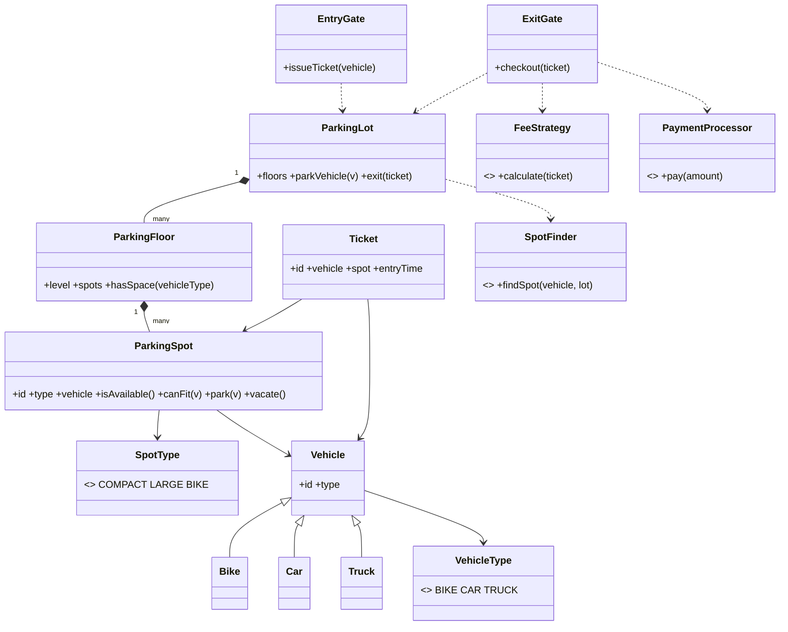

# Parking Lot

A parking lot looks trivial until you ask *who decides where a car goes* and *what happens when two cars race for the last spot*. It is the canonical first LLD because it exercises the whole path: entities, responsibilities, an allocation policy, a pricing policy, a payment boundary, and one correctness invariant — **a spot holds at most one vehicle**.

This follows the [8-phase LLD path](index.md): requirements → entities → responsibilities → relationships/interfaces → class diagram → core flows → critical code → edge cases/extensibility.

## 1. Requirements / Use Cases

Clarify, then scope explicitly.

Questions worth asking:

- Which vehicles — bikes, cars, trucks?
- Multiple floors? Different spot sizes?
- Entry and exit gates, or one gate?
- Do we issue a ticket? Is the ticket the source of truth?
- How is the fee calculated, and which payment methods?
- Do we need reservations, valet, or EV charging?

In scope for this design:

1. A lot with **multiple floors** and **multiple spot types** (compact, large, bike).
2. **Multiple vehicle types** (bike, car, truck) that fit different spots.
3. **Entry** issues a ticket and parks the vehicle; **exit** charges and frees the spot.
4. **Fee calculation** and **payment**.
5. One vehicle per spot, and a clear answer when the lot is full.

Non-functional assumptions:

- **Invariant:** a spot is occupied by at most one vehicle at a time.
- **No lost car:** if payment succeeds, the spot must be released; if release fails, it is retried.
- **Extensible policy:** allocation, pricing, and payment must be replaceable without rewriting the lot.

Out of scope: reservations, valet, EV charging, license-plate recognition, and dynamic surge pricing.

## 2. Core Entities

Nouns first; separate identity objects from value objects.

Objects with identity:

- `ParkingLot` — owns the floors and coordinates entry/exit.
- `ParkingFloor` — owns a set of spots.
- `ParkingSpot` — a physical slot; knows whether it is free and what it holds.
- `Vehicle` — with subclasses `Bike`, `Car`, `Truck` (is-a).
- `Ticket` — the record of one parking session.
- `EntryGate`, `ExitGate` — the physical interfaces to the lot.

Value objects and enums:

- `SpotType` = `COMPACT | LARGE | BIKE`.
- `VehicleType` = `BIKE | CAR | TRUCK`.

Abstractions (from the requirements, not invented up front):

- `SpotFinder` — the allocation policy ("where should this vehicle go?").
- `FeeStrategy` — the pricing policy ("what does this session cost?").
- `PaymentProcessor` — the payment boundary ("how is it paid?").

Do not create a class per getter; start with the objects the flows actually touch.

## 3. Responsibilities

Assign each behavior to the class that already owns the state it needs.

| Class | Owns / is responsible for |
|---|---|
| `ParkingLot` | The floors and the entry/exit workflow. It coordinates; it does not compute fees or choose spots itself. |
| `ParkingFloor` | Its own spots and whether a type of vehicle can be placed there. |
| `ParkingSpot` | Its own occupancy: `isAvailable()`, `canFit(vehicle)`, `park(vehicle)`, `vacate()`. This is the class that protects the one-vehicle invariant. |
| `Vehicle` | Identity and type; subclasses carry fit rules. |
| `Ticket` | The immutable record: vehicle, spot, entry time; used at exit. |
| `SpotFinder` | Allocation policy only. Holds no lot state. |
| `FeeStrategy` | Pricing policy only. |
| `PaymentProcessor` | Payment only. |

Deliberately *not* placed:

- `findSpot`, `calculateFee`, and `processPayment` inside `ParkingLot`. That single class becomes a God object and every policy change edits it.
- Pricing inside `Ticket`. A ticket is a record, not a calculator.
- Fit rules spread across the lot. Each spot knows what it can hold.

## 4. Relationships + Interfaces

is-a / has-a / uses-a, then interfaces at the points likely to change.

Relationships:

- `ParkingLot` **has many** `ParkingFloor` (composition).
- `ParkingFloor` **has many** `ParkingSpot` (composition).
- `ParkingSpot` **may contain** a `Vehicle` (association).
- `Ticket` **references** a `Vehicle` and a `ParkingSpot`.
- `EntryGate` / `ExitGate` **use** `ParkingLot`.

Interfaces — each discovered from a requirement that will change:

- "Where should the car park?" can vary (nearest, balanced, reserved) → **`SpotFinder`**.
- "How is the fee computed?" can vary (hourly, flat, vehicle-specific) → **`FeeStrategy`**.
- "How is it paid?" can vary (card, cash, UPI) → **`PaymentProcessor`**.

```txt
interface SpotFinder
  findSpot(vehicle: Vehicle, lot: ParkingLot) -> Optional<ParkingSpot>

interface FeeStrategy
  calculate(ticket: Ticket) -> Money

interface PaymentProcessor
  pay(amount: Money) -> PaymentResult
```

`Vehicle` is an is-a hierarchy (`Bike`, `Car`, `Truck`) so fit and pricing rules dispatch on type instead of a growing `if/else`. That is the requirement, not a pattern we announce: **polymorphism where behavior varies by type, Strategy where behavior varies by policy.**

## 5. Class Diagram



Important methods (not every getter):

- `ParkingSpot`: `isAvailable()`, `canFit(v)`, `park(v)`, `vacate()`.
- `ParkingLot`: `parkVehicle(v)`, `exit(ticket)`.
- `ParkingFloor`: `hasSpace(vehicleType)`, `findSpot(vehicle)`.
- `ExitGate`: `checkout(ticket)`.

## 6. Core Flows

Execute a use case through the objects; this exposes bad designs fast.

Entry:

```text
Car arrives at EntryGate
    ↓
EntryGate.issueTicket(car)
    ↓
ParkingLot.parkVehicle(car)
    ↓
SpotFinder.findSpot(car, lot)          // allocation policy
    ↓
ParkingSpot.park(car)                  // guards: isAvailable() && canFit(car)
    ↓
Ticket created (vehicle, spot, entryTime)
    ↓
Ticket returned; barrier opens
```

Exit:

```text
Driver presents Ticket at ExitGate
    ↓
ExitGate.checkout(ticket)
    ↓
FeeStrategy.calculate(ticket)          // pricing policy
    ↓
PaymentProcessor.pay(amount)           // payment boundary
    ↓
ParkingSpot.vacate()                    // release the spot
    ↓
Ticket closed; barrier opens
```

If you cannot say which object calls which collaborator, the class design is not finished. Notice that `ParkingLot` coordinates but delegates allocation, pricing, and payment.

## 7. Implement Critical Code

Implement only the parts with real design decisions: the fit/occupancy guard, the allocation policy, the pricing policy, and the checkout sequence.

```txt
class ParkingSpot
  park(v):
    if not isAvailable(): throw SpotTaken
    if not canFit(v):     throw WrongSpotType
    this.vehicle = v

  vacate():
    if this.vehicle == null: throw SpotEmpty
    this.vehicle = null

  canFit(v):
    return (type == COMPACT and v.type in {BIKE, CAR}) or
           (type == LARGE   and v.type in {CAR, TRUCK}) or
           (type == BIKE    and v.type == BIKE)

class ParkingLot
  parkVehicle(v):
    spot = spotFinder.findSpot(v, this)
    if spot == null: return LotFull
    spot.park(v)
    return new Ticket(vehicle = v, spot = spot, entryTime = now())

  exit(ticket):
    amount = feeStrategy.calculate(ticket)
    result = paymentProcessor.pay(amount)
    if not result.ok: return result
    ticket.spot.vacate()
    return result

class NearestSpotFinder implements SpotFinder
  findSpot(v, lot):
    for floor in lot.floors:             // scan nearest first
      for spot in floor.spots:
        if spot.isAvailable() and spot.canFit(v): return spot
    return null

class HourlyFeeStrategy implements FeeStrategy
  calculate(ticket):
    hours = ceil(ticket.durationHours())
    return rate(ticket.vehicle.type) * hours
```

## 8. Edge Cases + Extensibility + Wrap-Up

Attack your own design:

- **Two cars race for the last spot.** `isAvailable()` and `park()` must be atomic — a compare-and-set on the spot, or a per-spot lock, so only one `park()` wins.
- **Payment succeeds but releasing the spot fails.** Keep the spot marked "released pending" and retry `vacate()`; the ticket is the record used for reconciliation. Never charge twice on retry — make checkout idempotent with the ticket id.
- **No spot exists.** `findSpot` returns null and the gate reports the lot full; do not create a ticket.
- **Wrong spot type.** `canFit` rejects the assignment before parking.
- **Ticket lost.** The vehicle can be looked up by plate as a recovery path; the ticket is the fast path, not the only path.
- **Long session / clock skew.** Compute duration on the server clock or a monotonic clock, not the client.

Then say how change is absorbed — the part the interviewer is listening for:

- **New pricing model** → add a `FeeStrategy` implementation.
- **New payment provider** → add a `PaymentProcessor` implementation.
- **New allocation algorithm** (nearest, balanced, reserved) → add a `SpotFinder` implementation.
- **New vehicle type** → add a `Vehicle` subclass and its fit rule; the lot is unchanged.

Concurrency, stated plainly: the shared mutable state is the **occupancy of each spot**. The simplest correct model is one spot per lock (or an atomic `tryPark`), so contention is limited to a single spot rather than the whole lot. The invariant to protect under any interleaving: **a spot is occupied by at most one vehicle**.

Trade-offs:

| Choice | Why | Alternative | Trade-off |
|---|---|---|---|
| `SpotFinder` as an interface | Allocation policy changes independently of the lot | Hard-coded nearest-first | Simpler initially, but every policy change edits `ParkingLot` |
| `FeeStrategy` as an interface | Pricing changes often and per vehicle type | `if/else` on type inside `Ticket` | Fewer classes, but pricing logic sprawls |
| Vehicle inheritance | Fit and pricing dispatch on type | A single `Vehicle` with a type enum and switch | Fewer classes, but a growing switch |
| Per-spot lock / CAS | Contention limited to the one contended spot | One global lot lock | Simpler, but serializes the whole lot |

## Interactive Visualizer

Watch the design work: press **▶ Play** and vehicles arrive and leave on their own as the clock advances, or add one manually with **Car / Bike / Truck**. Follow `EntryGate → ParkingLot → SpotFinder → ParkingSpot → Ticket` on entry, and `FeeStrategy → PaymentProcessor → vacate()` when a vehicle's stay ends (or when you click a spot / its **Exit** button). Then use the **design lens**: flip the **SpotFinder** and **FeeStrategy** policies and watch allocation and revenue change, inspect responsibilities, and step through the **1–8** phase map.

<div
  id="parking-lot-visualizer"
  class="plv parking-lot-visualizer"
></div>

## Interview recap

The answer is: "`ParkingLot` coordinates entry and exit; `SpotFinder`, `FeeStrategy`, and `PaymentProcessor` are replaceable policies; each `ParkingSpot` guards its own one-vehicle invariant; and a ticket is the record that ties a vehicle to a spot."

Likely follow-ups:

- How do you prevent two cars from taking the same spot without a global lock?
- Checkout charged the customer but the spot did not free — how do you reconcile?
- How would reservations change the entities and the allocation policy?
- Why is `FeeStrategy` an interface rather than a method on `Ticket`?
