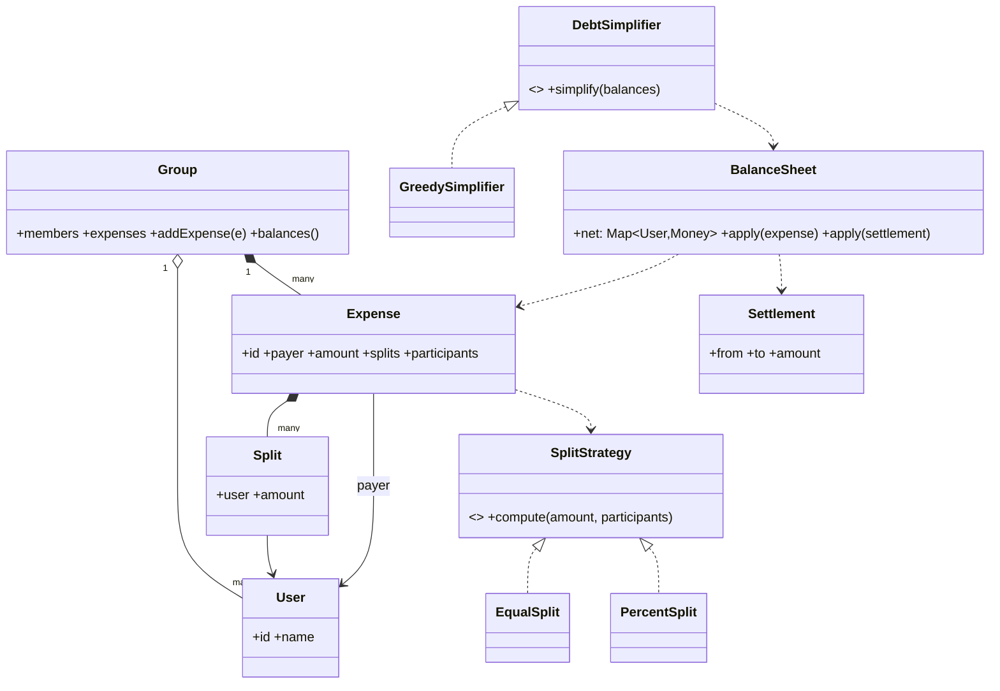

# Splitwise

Splitwise is two things wearing one name: a **ledger** that records who paid and who owes, and a **settlement algorithm** that turns the resulting balances into the fewest possible transfers. The design pressure is keeping balances correct under different split rules and settling up without a tangle of pairwise debts.

This follows the [8-phase LLD path](index.md): requirements → entities → responsibilities → relationships/interfaces → class diagram → core flows → critical code → edge cases/extensibility.

## 1. Requirements / Use Cases

Clarify, then scope explicitly.

Questions worth asking:

- Users only, or users inside groups?
- Which split rules — equal, exact amounts, percentages, shares?
- Do we show raw "who owes whom", or a simplified set of transfers?
- Can a settlement be partial? Can it be undone?
- One currency or many?

In scope for this design:

1. **Users** and **groups** of users.
2. **Add an expense**: one payer, an amount, participants, and a split rule.
3. Maintain each user's **net balance** within a group.
4. Show the **debt graph** (who owes whom) and optionally **simplify** it.
5. **Settle up**: record a payment that reduces balances.

Non-functional assumptions:

- **Invariant 1:** money is conserved — the net balances in a group always sum to zero.
- **Invariant 2:** an expense's splits sum exactly to its amount (handle rounding explicitly).
- **Invariant 3:** applying a settlement is idempotent; replaying it must not double-count.

Out of scope: multi-currency, recurring expenses, notifications, and receipt OCR.

## 2. Core Entities

Objects with identity:

- `User` — a person.
- `Group` — a set of members and their shared expenses.
- `Expense` — one payment: payer, amount, participants, and computed splits.
- `Split` — one participant's share of an expense.
- `BalanceSheet` — the ledger of net balances for a group.
- `Settlement` — a recorded payment from one user to another.
- `SettlementService` (or `DebtSimplifier`) — computes the transfers.

Value objects and enums:

- `Money` (amount, currency), `SplitType` (`EQUAL | EXACT | PERCENT | SHARES`).

Abstractions (from the requirements):

- `SplitStrategy` — how an amount is divided among participants.
- `DebtSimplifier` — how raw debts are reduced to a small transfer set.

## 3. Responsibilities

Assign each behavior to the class that owns the state it needs.

| Class | Owns / is responsible for |
|---|---|
| `Group` | Membership and the list of expenses. It coordinates; it does not compute splits or balances. |
| `Expense` | The immutable record of one payment and its computed `Split`s. |
| `SplitStrategy` | Dividing an amount among participants (equal, percent, …). |
| `BalanceSheet` | The net balance per user, and `apply(expense)` / `apply(settlement)`. This is where the sum-to-zero invariant lives. |
| `SettlementService` | Turning net balances into a minimal list of transfers. |
| `User` | Identity only. |

Deliberately *not* placed:

- Balance math inside `Expense`. An expense is a record; the ledger owns balances.
- Split rules inside `Group`. The rule varies, so it is a strategy.
- Simplification inside `BalanceSheet`. The ledger stores truth; simplification is a derived view.

## 4. Relationships + Interfaces

is-a / has-a / uses-a, then interfaces at the points likely to change.

Relationships:

- `Group` **has many** `User` and **has many** `Expense`.
- `Expense` **has many** `Split` and **references** a payer `User`.
- `BalanceSheet` **is updated by** `Expense` and `Settlement`.
- `SettlementService` **reads** the `BalanceSheet` and **produces** `Settlement`s.

Interfaces — discovered from requirements that will change:

- "How is the amount split?" varies (equal, exact, percent, shares) → **`SplitStrategy`**.
- "How do we reduce debts?" varies (raw, simplified, bank-settlement) → **`DebtSimplifier`**.

```txt
interface SplitStrategy
  compute(amount: Money, participants: User[]) -> Split[]

interface DebtSimplifier
  simplify(balances: Map<User, Money>) -> Settlement[]
```

The **Strategy pattern** falls out of "the split rule varies"; the simplification is a pure function of the ledger, so it stays out of the storage classes.

## 5. Class Diagram



Important methods (not every getter):

- `Group`: `addExpense(e)`, `balances()`.
- `Expense`: `splits()`, `payer()`.
- `SplitStrategy`: `compute(amount, participants)`.
- `BalanceSheet`: `apply(expense)`, `apply(settlement)`.
- `DebtSimplifier`: `simplify(balances)`.

## 6. Core Flows

Execute a use case through the objects.

Add an expense (Alice pays $40, split equally among 4):

```text
Group.addExpense(payer=Alice, amount=$40, participants=[A,B,C,D])
    ↓
Expense created (payer, amount, participants)
    ↓
SplitStrategy.compute($40, [A,B,C,D])   // EQUAL → $10 each
    ↓
Expense.splits = [A:$10, B:$10, C:$10, D:$10]
    ↓
BalanceSheet.apply(expense):
    Alice += $40 (paid)
    A,B,C,D -= $10 (owed)
    ↓
Net: Alice +$30, Bob -$10, Carol -$10, Dave -$10   (sum = 0)
```

Settle up:

```text
SettlementService.simplify(balances)
    ↓
DebtSimplifier.simplify({Alice:+30, Bob:-10, Carol:-10, Dave:-10})
    ↓
Greedy: match largest debtor to largest creditor → [Bob→Alice $10, Carol→Alice $10, Dave→Alice $10]
    ↓
On payment: BalanceSheet.apply(settlement) → balances move toward zero
```

Balance update rule (the whole ledger in one line): for an expense, the payer is **credited** the amount and every participant is **debited** their split. A settlement is the reverse: the payer is debited, the receiver credited.

## 7. Implement Critical Code

Implement the strategy, the ledger, and the simplifier; skip CRUD.

```txt
interface SplitStrategy
  compute(amount, participants): Split[]

class EqualSplit implements SplitStrategy
  compute(amount, participants):
    n = participants.size
    base = amount / n
    splits = participants.map(p -> base)
    splits.last += amount - base * n        // put the rounding remainder on one person
    return splits

class PercentSplit implements SplitStrategy
  compute(amount, participants):            // percentages must sum to 100
    return participants.map(p -> amount * p.percent / 100)

class BalanceSheet
  net: Map<User, Money>

  apply(expense):
    net[expense.payer] += expense.amount
    for s in expense.splits: net[s.user] -= s.amount

  apply(settlement):
    net[settlement.from] += settlement.amount   // debtor pays down
    net[settlement.to]   -= settlement.amount

class GreedySimplifier implements DebtSimplifier
  simplify(balances):
    debtors  = balances where amount < 0
    creditors = balances where amount > 0
    settlements = []
    while debtors and creditors:
      d = debtors.max(-amount); c = creditors.max(amount)
      pay = min(-d.amount, c.amount)
      settlements.push(Settlement(d.user, c.user, pay))
      d.amount += pay; c.amount -= pay
      if d.amount == 0: remove d
      if c.amount == 0: remove c
    return settlements
```

## 8. Edge Cases + Extensibility + Wrap-Up

Attack your own design:

- **Rounding.** Equal split of $10 among 3 is not integer. Compute in the smallest unit (cents) and assign the remainder to one participant so splits sum exactly to the amount.
- **Deleted member with a balance.** Removing a user who still owes money must not make the ledger un-settleable; block removal or carry the balance.
- **Partial settlement.** A settlement can be any amount ≤ the debt; the ledger just moves partway.
- **Duplicate settlement.** Make `apply(settlement)` idempotent by settlement id so a retry does not double-pay.
- **Percentages that do not sum to 100.** Validate before creating the expense.
- **Zero-amount or single-participant expense.** Allowed, but must still keep the sum-to-zero invariant.

Then say how change is absorbed — the part the interviewer is listening for:

- **New split type** (shares, by-item) → add a `SplitStrategy` implementation.
- **New simplification** (bank settlement, minimum number of transfers is NP-hard in general; greedy is the practical default) → add a `DebtSimplifier`.
- **Multi-currency** → money carries a currency; the ledger is per currency.
- **Recurring expenses / notifications** → new collaborators; the ledger is unchanged.

Concurrency, stated plainly: the shared mutable state is the **balance sheet of a group**. Two expenses added at once must not lose an update, so serialize per-group writes (a per-group lock or an append-only log that is folded into balances). The invariant under any interleaving: **the group's balances always sum to zero**.

Trade-offs:

| Choice | Why | Alternative | Trade-off |
|---|---|---|---|
| `SplitStrategy` as an interface | Split rules change often | `switch (splitType)` inside `Expense` | Fewer classes, but every rule edits the record |
| Ledger owns balances | One place holds the sum-to-zero invariant | Recompute by scanning all expenses | Simpler reads, but O(n) and easy to drift |
| Greedy simplification | Near-minimal transfers in O(n log n) | Optimal min-transfer (NP-hard) | Provably fewest, but impractical |
| Append-only expenses | Auditable and replayable | Mutate balances in place | Simple, but no history and hard to correct |

## Interactive Visualizer

Add expenses and watch the **ledger** update: pick a payer and amount, then **Add expense**. Net balances appear per user; the **debt graph** shows who owes whom. Press **Settle up** to run the simplifier and see the transfers collapse to the minimum set. Use the **design lens** to swap the **SplitStrategy** (Equal ↔ Percent) and the **DebtSimplifier** (Raw ↔ Greedy), and step through the **1–8** phase map.

<div
  id="splitwise-visualizer"
  class="swv splitwise-visualizer"
></div>

## Interview recap

The answer is: "a `Group` owns expenses; an `Expense` is a record with computed splits; a `SplitStrategy` divides the amount; a `BalanceSheet` owns net balances and keeps them summing to zero; and a `DebtSimplifier` turns balances into the fewest transfers."

Likely follow-ups:

- How do you split $10 among 3 people without losing a cent?
- Why is the balance sheet a better source of truth than summing expenses on read?
- How would you add a "shares" split type without touching `Expense`?
- Two expenses are added at the same instant — how do you keep balances correct?
