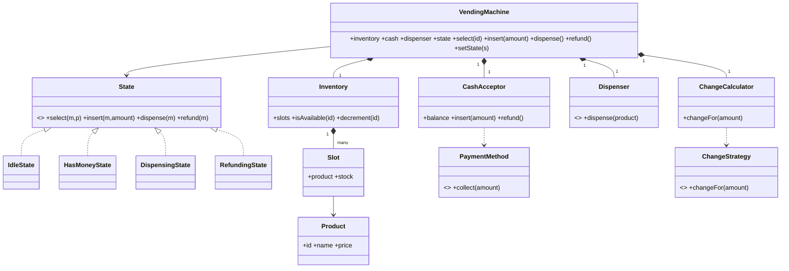

# Vending Machine

A vending machine is a state machine wearing a payment system. The design pressure is sequencing: **never dispense without full payment**, **never lose money on a refund**, and **never sell an empty slot**. Almost every bug in a vending machine is an illegal transition, which is exactly why it is a great State-pattern problem.

This follows the [8-phase LLD path](index.md): requirements → entities → responsibilities → relationships/interfaces → class diagram → core flows → critical code → edge cases/extensibility.

## 1. Requirements / Use Cases

Clarify, then scope explicitly.

Questions worth asking:

- Which payment methods — coins, notes, card, wallet?
- Is change always available, or only sometimes?
- Can a customer cancel and get a refund?
- What happens when a product is out of stock or the dispenser jams?
- One machine, or a fleet with restocking and telemetry?

In scope for this design:

1. A machine with **slots** holding products (name, price, stock).
2. A customer **selects** a product and **inserts money** (coins/notes or card).
3. The machine **dispenses** the product when payment is sufficient and stock exists.
4. It **returns change**, and supports **cancel/refund** before dispensing.
5. It reports **out-of-stock** and **insufficient funds** clearly.

Non-functional assumptions:

- **Invariant 1:** the machine never dispenses unless `balance >= price` and stock is available.
- **Invariant 2:** money is conserved — value inserted = value dispensed + change returned (+ refunds).
- **Invariant 3:** only one transaction at a time; the state transition is the critical section.

Out of scope: restocking admin, remote telemetry, loyalty pricing, and multi-machine inventory.

## 2. Core Entities

Objects with identity:

- `VendingMachine` — the facade the panel and hardware talk to.
- `Slot` — one position holding a `Product` and a stock count.
- `Inventory` — the set of slots.
- `Product` — name, price, id.
- `CashAcceptor` — takes money and tracks the inserted balance.
- `Dispenser` — the physical output; it can fail.
- `ChangeCalculator` — decides which coins/notes to return.
- `SelectionPanel` — the buttons/keypad.
- `State` — the current machine state.

Value objects and enums:

- `Money` (amount, currency), `ProductId`, `Denomination`.
- States: `IDLE`, `HAS_MONEY`, `DISPENSING`, `REFUNDING` (plus `OUT_OF_SERVICE`).

Abstractions (from the requirements):

- `PaymentMethod` — cash vs card.
- `ChangeStrategy` — how change is composed.
- `Dispenser` — hardware seam so the machine can be tested with a fake.

## 3. Responsibilities

Assign each behavior to the class that owns the state it needs.

| Class | Owns / is responsible for |
|---|---|
| `VendingMachine` | The current `State` and delegating actions to it. It does not contain the per-state rules. |
| `State` (`Idle`, `HasMoney`, `Dispensing`, `Refunding`) | What each action does in that state, and which transitions are legal. This is where the invariants live. |
| `Inventory` / `Slot` | Stock: `isAvailable()`, `decrement()`. |
| `CashAcceptor` | The inserted balance; `insert()`, `refund()`. |
| `Dispenser` | Physical dispensing, which can fail and must be reported. |
| `ChangeCalculator` | Change composition; it does not hold the balance. |
| `PaymentMethod` | How money enters (cash, card). |

Deliberately *not* placed:

- All the `if (state === ...)` logic inside `VendingMachine`. That is a state machine in disguise; make the states first-class.
- Dispensing and change logic inside `CashAcceptor`. Money in and product out are different concerns.
- Stock checks scattered across the machine. The slot knows its stock.

## 4. Relationships + Interfaces

is-a / has-a / uses-a, then interfaces at the points likely to change.

Relationships:

- `VendingMachine` **has** one `Inventory`, one `CashAcceptor`, one `Dispenser`, one `ChangeCalculator`, and one current `State`.
- `Inventory` **has many** `Slot`; a `Slot` **has** a `Product`.
- `VendingMachine` **transitions between** `State` objects.

Interfaces — discovered from requirements that will change:

- "How does money enter?" can vary (cash, card, wallet) → **`PaymentMethod`**.
- "How is change composed?" can vary (greedy, exact-only) → **`ChangeStrategy`**.
- "How does the product come out?" is hardware and can fail → **`Dispenser`**.

```txt
interface State
  select(machine, productId)
  insert(machine, money)
  dispense(machine)
  refund(machine)

interface PaymentMethod
  collect(amount) -> PaymentResult

interface ChangeStrategy
  changeFor(amount, availableDenominations) -> Money[]
```

The **State pattern** falls out of "behavior depends on the current state"; the **Strategy pattern** falls out of "payment and change vary independently". Name the problem, then the pattern.

## 5. Class Diagram



Important methods (not every getter):

- `VendingMachine`: `select(id)`, `insert(amount)`, `dispense()`, `refund()`, `setState(s)`.
- `State`: `select/insert/dispense/refund`.
- `Inventory`: `isAvailable(id)`, `decrement(id)`.
- `ChangeCalculator`: `changeFor(amount)`.

## 6. Core Flows

Execute a use case through the objects.

Buy (success):

```text
Customer selects A1
    ↓
IdleState.select(machine, "A1")        // in stock → remember selection, stay IDLE
    ↓
Customer inserts $2
    ↓
IdleState.insert(machine, $2)          // balance > 0 → transition to HAS_MONEY
    ↓
Customer inserts $1 (balance $3 ≥ price $2.50)
    ↓
HasMoneyState.dispense(machine)        // enough → transition to DISPENSING
    ↓
Inventory.decrement("A1"); Dispenser.dispense(product)
    ↓
ChangeCalculator.changeFor($0.50) → return change
    ↓
DispensingState → IDLE
```

Cancel/refund:

```text
HasMoneyState.refund(machine)
    ↓
CashAcceptor.refund()  // return the full inserted balance
    ↓
→ IDLE
```

State transition table:

| State | Action | Next | Guard |
|---|---|---|---|
| `IDLE` | select(id) | `IDLE` | slot in stock |
| `IDLE` | insert(amount) | `HAS_MONEY` | amount > 0 |
| `HAS_MONEY` | insert(amount) | `HAS_MONEY` | — |
| `HAS_MONEY` | dispense() | `DISPENSING` | balance ≥ price |
| `HAS_MONEY` | refund() | `REFUNDING` → `IDLE` | balance > 0 |
| `DISPENSING` | (dispense done) | `IDLE` | dispenser succeeded |
| `DISPENSING` | (dispense failed) | `REFUNDING` | jam → refund |

If you cannot say which object handles each action in each state, the design is not finished.

## 7. Implement Critical Code

Implement the state boundary and the two policies; skip boilerplate.

```txt
interface State
  select(machine, productId):  raise NotAllowed
  insert(machine, amount):     raise NotAllowed
  dispense(machine):           raise NotAllowed
  refund(machine):             raise NotAllowed

class IdleState implements State
  select(machine, id):
    if not machine.inventory.isAvailable(id): return OutOfStock
    machine.selected = id

  insert(machine, amount):
    machine.cash.insert(amount)
    machine.setState(new HasMoneyState())

class HasMoneyState implements State
  insert(machine, amount): machine.cash.insert(amount)

  dispense(machine):
    price = machine.inventory.priceOf(machine.selected)
    if machine.cash.balance < price: return InsufficientFunds
    machine.setState(new DispensingState())
    machine.dispenseInternal(price)

  refund(machine):
    machine.cash.refund()          // return everything inserted
    machine.setState(new IdleState())

class VendingMachine
  dispenseInternal(price):
    try:
      machine.inventory.decrement(machine.selected)
      machine.dispenser.dispense(machine.selected)     // may throw Jam
      change = machine.changeCalculator.changeFor(machine.cash.balance - price)
      machine.cash.take(price)                          // keep the price
      machine.cash.refund()                             // return the change
      machine.setState(new IdleState())
    catch Jam:
      machine.cash.refund()                             // never keep money without product
      machine.setState(new IdleState())
```

## 8. Edge Cases + Extensibility + Wrap-Up

Attack your own design:

- **Dispenser jams after payment.** Refund the full balance; the product must not be lost from stock unless it actually came out. Make the dispense step idempotent by the transaction id.
- **Exact change unavailable.** The machine may refuse the purchase (or refuse the note) rather than short-change; state it as a policy.
- **Card declined mid-transaction.** `PaymentMethod.collect` returns failure; stay in `IDLE` with no balance.
- **Cancel after dispense.** Not allowed — `IDLE` refuses `refund`.
- **Double insert / repeated press.** Actions are idempotent per state; a second `dispense()` in `DISPENSING` is ignored.
- **Power loss mid-dispense.** On boot, reconcile: any transaction not marked complete is refunded.

Then say how change is absorbed — the part the interviewer is listening for:

- **New payment method** (wallet, QR) → add a `PaymentMethod` implementation.
- **New change policy** (exact-only, prefer large coins) → add a `ChangeStrategy` implementation.
- **New product or price** → data in `Inventory`; no code change.
- **New machine capability** (age check, loyalty) → a new state or a decorator around the transition, not edits scattered across `VendingMachine`.

Concurrency, stated plainly: a vending machine serves one customer at a time, so the shared state is the **current state + balance + selected slot**. The critical section is the `dispense()` transition; a single lock (or the single-threaded event loop of the panel) makes it atomic. The invariant under any interleaving: **money and product move together or not at all**.

Trade-offs:

| Choice | Why | Alternative | Trade-off |
|---|---|---|---|
| State pattern for the machine | Illegal transitions become unreachable | `if (state === ...)` in `VendingMachine` | Fewer classes, but every rule is reachable and untestable in isolation |
| `PaymentMethod` interface | Cash and card change independently | Hard-coded cash acceptor | Simpler, but adding a wallet edits the machine |
| `ChangeStrategy` interface | Change policies differ by country/coin set | One greedy routine | Simpler, but policy changes ripple |
| Refund-on-jam | Money is never kept without product | Retry dispense | Retry can double-dispense; refund is safer |

## Interactive Visualizer

Buy a product: click a **slot**, insert **$1 / $2 / $5**, then **Buy** (or let it auto-dispense once the balance covers the price). Watch the **state machine** move `IDLE → HAS_MONEY → DISPENSING → IDLE`, and **Refund** to cancel. Press **▶ Play** to run a stream of customers. Use the **design lens** to inspect responsibilities, flip the **Payment** and **Change** policies, and step through the **1–8** phase map.

<div
  id="vending-machine-visualizer"
  class="vmv vending-machine-visualizer"
></div>

## Interview recap

The answer is: "the machine is a state machine — `IDLE`, `HAS_MONEY`, `DISPENSING`, `REFUNDING` — where each state owns the legal transitions; inventory owns stock, the cash acceptor owns the balance, and payment and change are replaceable policies."

Likely follow-ups:

- Where exactly do you guarantee "never dispense without full payment"?
- Payment succeeded but the dispenser jammed — what is the correct next state?
- How would you add a wallet/QR payment without touching the state classes?
- How does the design change if the machine must give exact change or refuse the sale?
